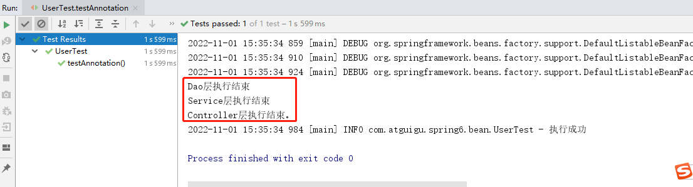

# Spring6


## 0、課程網址
https://www.bilibili.com/video/BV1kR4y1b7Qc/?p=1

## 1、概述

### 1.1、Spring是什麼？
Spring是一款主流的Java EE輕量級開源框架 ， Spring由“ Spring之父” Rod Johnson提出並創立，其目的是用於簡化Java企業級應用的開發難度和開發週期。 Spring的用途不僅限於服務器端的開發。從簡單性、可測試性和松耦合的角度而言，任何Java應用都可以從Spring中受益。 Spring框架除了自己提供功能外，還提供整合其他技術和框架的能力。

Spring自誕生以來備受青睞，一直被廣大開發人員作為Java企業級應用程序開發的首選。時至今日， Spring儼然成為了Java EE代名詞，成為了構建Java EE應用的事實標準。

自2004年4月， Spring 1.0版本正式發布以來， Spring已經步入到了第6個大版本，也就是Spring 6 。本課程採用Spring當前最新發布的正式版本**6.0.2** 。


### 1.2 、 Spring的狹義和廣義
在不同的語境中， Spring所代表的含義是不同的。下面我們就分別從“廣義”和“狹義”兩個角度，對Spring進行介紹。

**廣義的Spring ： Spring技術棧**

廣義上的Spring泛指以Spring Framework為核心的Spring技術棧。

經過十多年的發展， Spring已經不再是一個單純的應用框架，而是逐漸發展成為一個由多個不同子項目（模塊）組成的成熟技術，例如Spring Framework 、 Spring MVC 、 SpringBoot 、 Spring Cloud 、 Spring Data 、 Spring Security等，其中 Spring Framework是其他子項目的基礎。

這些子項目涵蓋了從企業級應用開發到雲計算等各方面的內容，能夠幫助開發人員解決軟件發展過程中不斷產生的各種實際問題，給開發人員帶來了更好的開發體驗。

**狹義的Spring ： Spring Framework**

狹義的Spring特指Spring Framework ，通常我們將它稱為Spring框架。

Spring框架是一個分層的、面向切面的Java應用程序的一站式輕量級解決方案，它是Spring技術棧的核心和基礎，是為了解決企業級應用開發的複雜性而創建的。

Spring有兩個最核心模塊： IoC和AOP 。

**IoC** ： Inverse of Control的簡寫，譯為“控制反轉”，指把創建對象過程交給Spring進行管理。

**AOP** ： Aspect Oriented Programming的簡寫，譯為“面向切面編程”。 AOP用來封裝多個類的公共行為，將那些與業務無關，卻為業務模塊所共同調用的邏輯封裝起來，減少系統的重複代碼，降低模塊間的耦合度。另外， AOP還解決一些系統層面上的問題，比如日誌、事務、權限等。

### 1.3 、 Spring Framework特點
- 非侵入式：使用Spring Framework開發應用程序時， Spring對應用程序本身的結構影響非常小。對領域模型可以做到零污染；對功能性組件也只需要使用幾個簡單的註解進行標記，完全不會破壞原有結構，反而能將組件結構進一步簡化。這就使得基於Spring Framework開發應用程序時結構清晰、簡潔優雅。
  
- 控制反轉： IoC——Inversion of Control ，翻轉資源獲取方向。把自己創建資源、向環境索取資源變成環境將資源準備好，我們享受資源注入。
  
- 面向切面編程： AOP——Aspect Oriented Programming ，在不修改源代碼的基礎上增強代碼功能。
  
- 容器： Spring IoC是一個容器，因為它包含並且管理組件對象的生命週期。組件享受到了容器化的管理，替程序員屏蔽了組件創建過程中的大量細節，極大的降低了使用門檻，大幅度提高了開發效率。

- 組件化： Spring實現了使用簡單的組件配置組合成一個複雜的應用。在Spring中可以使用XML和Java註解組合這些對象。這使得我們可以基於一個個功能明確、邊界清晰的組件有條不紊的搭建超大型複雜應用系統。

- 一站式：在IoC和AOP的基礎上可以整合各種企業應用的開源框架和優秀的第三方類庫。而且Spring旗下的項目已經覆蓋了廣泛領域，很多方面的功能性需求可以在Spring Framework的基礎上全部使用Spring來實現。

### 1.4 、 Spring模塊組成
官網網址：https://spring.io/


上圖中包含了Spring框架的所有模塊，這些模塊可以滿足一切企業級應用開發的需求，在開發過程中可以根據需求有選擇性地使用所需要的模塊。下面分別對這些模塊的作用進行簡單介紹。

**① Spring Core （核心容器）**
spring core提供了IOC,DI,Bean配置裝載創建的核心實現。核心概念： Beans 、 BeanFactory 、 BeanDefinitions 、 ApplicationContext 。

- spring-core ： IOC和DI的基本實現
- spring-beans ： BeanFactory和Bean的裝配管理(BeanFactory)
- spring-context：Spring context上下文，即IOC容器(AppliactionContext)
- spring-expression ： spring表達式語言

**② Spring AOP**
- spring-aop ：面向切面編程的應用模塊，整合ASM ， CGLib ， JDK Proxy
- spring-aspects ：集成AspectJ ， AOP應用框架
- spring-instrument ：動態Class Loading模塊

**③ Spring Data Access**
- spring-jdbc ： spring對JDBC的封裝，用於簡化jdbc操作
- spring-orm ： java對象與數據庫數據的映射框架
- spring-oxm ：對象與xml文件的映射框架
- spring-jms ： Spring對Java Message Service(java消息服務)的封裝，用於服務之間相互通信
- spring-tx ： spring jdbc事務管理

**④ Spring Web**
- spring-web ：最基礎的web支持，建立於spring-context之上，通過servlet或listener來初始化IOC容器
- spring-webmvc ：實現web mvc
- spring-websocket ：與前端的全雙工通信協議
- spring-webflux ： Spring 5.0提供的，用於取代傳統java servlet ，非阻塞式Reactive Web框架，異步，非阻塞，事件驅動的服務

**⑤ Spring Message**
- Spring-messaging ： spring 4.0提供的，為Spring集成一些基礎的報文傳送服務

**⑥ Spring test**
- spring-test ：集成測試支持，主要是對junit的封裝

### 1.5 、 Spring6特點

#### 1.5.1、版本要求
**（1）Spring6要求JDK最低版本是JDK17**


#### 1.5.2 、本課程軟件版本
1. IDEA開發工具： 2022.1.2
2. JDK：Java17**（Spring6要求JDK最低版本是Java17）**
3. Spring：6.0.2

****

## 2 、入門

### 2.1 、環境要求
- JDK：Java17+**（Spring6要求JDK最低版本是Java17）**
- Maven：3.6+
- Spring：6.0.2

### 2.2 、構建模塊
**（ 1 ）構建父模塊spring6**

在idea中，依次單擊File -> New -> Project -> New Project


點擊“ Create”


刪除src目錄

**（ 2 ）構建子模塊spring6-first**


點擊Create完成


### 2.3 、程序開發

#### 2.3.1 、引入依賴
https://spring.io/projects/spring-framework#learn

**添加依賴：**

```xml
<dependencies>
  <!--spring context依賴-->
  <!--當你引入Spring Context依賴之後，表示將Spring的基礎依賴引入了-->
  <dependency>
    <groupId>org.springframework</groupId>
    <artifactId>spring-context</artifactId>
    <version>6.0.2</version>
  </dependency>

  <!--junit5測試-->
  <dependency>
    <groupId>org.junit.jupiter</groupId>
    <artifactId>junit-jupiter-api</artifactId>
    <version>5.3.1</version>
  </dependency>
</dependencies>
```

**查看依賴：**


#### 2.3.2 、創建java類
```java
package com.atguigu.spring6.bean;

public class HelloWorld {
    
public void sayHello(){
System.out.println("helloworld");
}
}
```

#### 2.3.3 、創建配置文件
在resources目錄創建一個Spring配置文件beans.xml （配置文件名稱可隨意命名，如： springs.xm ）


```xml
<?xml version="1.0" encoding="UTF-8"?>
<beans xmlns="http://www.springframework.org/schema/beans"
xmlns:xsi="http://www.w3.org/2001/XMLSchema-instance"
xsi:schemaLocation="http://www.springframework.org/schema/beans http://www.springframework.org/schema/beans/spring-beans.xsd">

<!--
    配置HelloWorld所對應的bean ，即將HelloWorld的對象交給Spring的IOC容器管理
    通過bean標籤配置IOC容器所管理的bean
    屬性：
id ：設置bean的唯一標識
class ：設置bean所對應類型的全類名
	-->
<bean id="helloWorld" class="com.atguigu.spring6.bean.HelloWorld"></bean>
    
</beans>
```

#### 2.3.4 、創建測試類測試
```java
package com.atguigu.spring6.bean;

import org.junit.jupiter.api.Test;
import org.springframework.context.ApplicationContext;
import org.springframework.context.support.ClassPathXmlApplicationContext;

public class HelloWorldTest {

@Test
public void testHelloWorld(){
ApplicationContext ac = new ClassPathXmlApplicationContext("beans.xml");
HelloWorld helloworld = (HelloWorld) ac.getBean("helloWorld");
helloworld.sayHello();
}
}
```

#### 2.3.5 、運行測試程序


### 2.4、程序分析
**1.底層是怎麼創建對象的，是通過反射機制調用無參數構造方法嗎？**

修改HelloWorld類：

```java
package com.atguigu.spring6.bean;

public class HelloWorld {

public HelloWorld() {
System.out.println("無參數構造方法執行");
}

public void sayHello(){
System.out.println("helloworld");
}
}
```

執行結果：


**測試得知：創建對象時確實調用了無參數構造方法。**


**2. Spring是如何創建對象的呢？原理是什麼？**

```java
//dom4j解析beans.xml文件，從中獲取class屬性值，類的全類名
//通過反射機制調用無參數構造方法創建對象
Class clazz = Class.forName("com.atguigu.spring6.bean.HelloWorld");
//Object obj = clazz.newInstance();
Object object = clazz.getDeclaredConstructor().newInstance();
```


**3.把創建好的對象存儲到一個什麼樣的數據結構當中了呢？**

bean對象最終存儲在spring容器中，在spring源碼底層就是一個map集合，存儲bean的map在**DefaultListableBeanFactory**類中：

```java
private final Map<String, BeanDefinition> beanDefinitionMap = new ConcurrentHashMap<>(256);
```

Spring容器加載到Bean類時,會把這個類的描述信息,以包名加類名的方式存到beanDefinitionMap中,
Map<String,BeanDefinition> ,其中String是Key ,默認是類名首字母小寫, BeanDefinition ,存的是類的定義(描述信息) ,我們通常叫BeanDefinition接口為: bean的定義對象。

### 2.5 、啟用Log4j2日誌框架

#### 2.5.1、Log4j2日誌概述
在項目開發中，日誌十分的重要，不管是記錄運行情況還是定位線上問題，都離不開對日誌的分析。日誌記錄了系統行為的時間、地點、狀態等相關信息，能夠幫助我們了解並監控系統狀態，在發生錯誤或者接近某種危險狀態時能夠及時提醒我們處理，同時在系統產生問題時，能夠幫助我們快速的定位、診斷並解決問題。

**Apache Log4j2**是一個開源的日誌記錄組件，使用非常的廣泛。在工程中以易用方便代替了System.out等打印語句，它是JAVA下最流行的日誌輸入工具。 

**Log4j2主要由幾個重要的組件構成：**

**（ 1 ）日誌信息的優先級** ，日誌信息的優先級從高到低有**TRACE < DEBUG < INFO < WARN < ERROR < FATAL**
- TRACE ：追踪，是最低的日誌級別，相當於追踪程序的執行
- DEBUG ：調試，一般在開發中，都將其設置為最低的日誌級別
- INFO ：信息，輸出重要的信息，使用較多
- WARN ：警告，輸出警告的信息
- ERROR ：錯誤，輸出錯誤信息
- FATAL ：嚴重錯誤

這些級別分別用來指定這條日誌信息的重要程度；級別高的會自動屏蔽級別低的日誌，也就是說，設置了WARN的日誌，則INFO 、 DEBUG的日誌級別的日誌不會顯示

**（ 2 ）日誌信息的輸出目的地** ，日誌信息的輸出目的地指定了日誌將打印到**控制台**還是**文件中**

**（ 3 ）日誌信息的輸出格式** ，而輸出格式則控制了日誌信息的顯示內容。

#### 2.5.2 、引入Log4j2依賴
```xml
<!--log4j2的依賴-->
<dependency>
<groupId>org.apache.logging.log4j</groupId>
<artifactId>log4j-core</artifactId>
<version>2.19.0</version>
</dependency>
<dependency>
<groupId>org.apache.logging.log4j</groupId>
<artifactId>log4j-slf4j2-impl</artifactId>
<version>2.19.0</version>
</dependency>
```

#### 2.5.3、加入日誌配置文件
在類的根路徑下提供log4j2.xml配置文件（文件名固定為： log4j2.xml ，文件必須放到類根路徑下。）

```xml
<?xml version="1.0" encoding="UTF-8"?>
<configuration>
<loggers>
<!--
level指定日誌級別，從低到高的優先級：
TRACE < DEBUG < INFO < WARN < ERROR < FATAL
trace ：追踪，是最低的日誌級別，相當於追踪程序的執行
debug ：調試，一般在開發中，都將其設置為最低的日誌級別
info ：信息，輸出重要的信息，使用較多
warn ：警告，輸出警告的信息
error ：錯誤，輸出錯誤信息
fatal ：嚴重錯誤
-->
<root level="DEBUG">
<appender-ref ref="spring6log"/>
<appender-ref ref="RollingFile"/>
<appender-ref ref="log"/>
</root>
</loggers>

<appenders>
<!--輸出日誌信息到控制台-->
<console name="spring6log" target="SYSTEM_OUT">
<!--控制日誌輸出的格式-->
<PatternLayout pattern="%d{yyyy-MM-dd HH:mm:ss SSS} [%t] %-3level %logger{1024} - %msg%n"/>
</console>

<!--文件會打印出所有信息，這個log每次運行程序會自動清空，由append屬性決定，適合臨時測試用-->
<File name="log" fileName="d:/spring6_log/test.log" append="false">
<PatternLayout pattern="%d{HH:mm:ss.SSS} %-5level %class{36} %L %M - %msg%xEx%n"/>
</File>

<!--這個會打印出所有的信息，
            每次大小超過size ，
            則這size大小的日誌會自動存入按年份-月份建立的文件夾下面並進行壓縮，
            作為存檔-->
<RollingFile name="RollingFile" fileName="d:/spring6_log/app.log"
filePattern="log/$${date:yyyy-MM}/app-%d{MM-dd-yyyy}-%i.log.gz">
<PatternLayout pattern="%d{yyyy-MM-dd 'at' HH:mm:ss z} %-5level %class{36} %L %M - %msg%xEx%n"/>
<SizeBasedTriggeringPolicy size="50MB"/>
<!-- DefaultRolloverStrategy屬性如不設置，
            則默認為最多同一文件夾下7個文件，這裡設置了20 -->
<DefaultRolloverStrategy max="20"/>
</RollingFile>
</appenders>
</configuration>
```

#### 2.5.4 、測試
運行原測試程序


運行原測試程序，多了spring打印日誌

#### 2.5.5、使用日誌
```java
public class HelloWorldTest {

private Logger logger = LoggerFactory.getLogger(HelloWorldTest.class);

@Test
public void testHelloWorld(){
ApplicationContext ac = new ClassPathXmlApplicationContext("beans.xml");
HelloWorld helloworld = (HelloWorld) ac.getBean("helloWorld");
helloworld.sayHello();
logger.info("執行成功");
}
}
```

控制台：


****

## 3、容器：IoC
IoC是Inversion of Control的簡寫，譯為“控制反轉”，它不是一門技術，而是一種設計思想，是一個重要的面向對象編程法則，能夠指導我們如何設計出松耦合、更優良的程序。

Spring通過IoC容器來管理所有Java對象的實例化和初始化，控制對象與對象之間的依賴關係。我們將由IoC容器管理的Java對象稱為Spring Bean ，它與使用關鍵字new創建的Java對像沒有任何區別。

IoC容器是Spring框架中最重要的核心組件之一，它貫穿了Spring從誕生到成長的整個過程。

### 3.1、IoC容器

#### 3.1.1 、控制反轉（ IoC ）
-控制反轉是一種思想。
-控制反轉是為了降低程序耦合度，提高程序擴展力。
-控制反轉，反轉的是什麼？

- -將對象的創建權利交出去，交給第三方容器負責。
-將對象和對象之間關係的維護權交出去，交給第三方容器負責。

-控制反轉這種思想如何實現呢？

- - DI （ Dependency Injection ）：依賴注入

#### 3.1.2 、依賴注入
DI （ Dependency Injection ）：依賴注入，依賴注入實現了控制反轉的思想。

**依賴注入：**

- **指Spring創建對象的過程中，將對象依賴屬性通過配置進行注入**

依賴注入常見的實現方式包括兩種：

- 第一種：set注入
- 第二種：構造注入

所以結論是： IOC就是一種控制反轉的思想， 而DI是對IoC的一種具體實現。

**Bean管理說的是： Bean對象的創建，以及Bean對像中屬性的賦值（或者叫做Bean對象之間關係的維護）。 **

#### 3.1.3 、 IoC容器在Spring的實現

Spring的IoC容器就是IoC思想的一個落地的產品實現。 IoC容器中管理的組件也叫做bean 。在創建bean之前，首先需要創建IoC容器。 Spring提供了IoC容器的兩種實現方式：

**① BeanFactory**

這是IoC容器的基本實現，是Spring內部使用的接口。面向Spring本身，不提供給開發人員使用。

**② ApplicationContext**

BeanFactory的子接口，提供了更多高級特性。面向Spring的使用者，幾乎所有場合都使用ApplicationContext而不是底層的BeanFactory 。

**③ ApplicationContext的主要實現類**


|類型名|簡介|
| ------------------------------- | ------------------------------------------------------------ |
| ClassPathXmlApplicationContext |通過讀取類路徑下的XML格式的配置文件創建IOC容器對象|
| FileSystemXmlApplicationContext |通過文件系統路徑讀取XML格式的配置文件創建IOC容器對象|
| ConfigurableApplicationContext | ApplicationContext的子接口，包含一些擴展方法refresh()和close() ，讓ApplicationContext具有啟動、關閉和刷新上下文的能力。 |
| WebApplicationContext |專門為Web應用準備，基於Web環境創建IOC容器對象，並將對象引入存入ServletContext域中。 |

### 3.2、基於XML管理Bean

#### 3.2.1 、搭建子模塊spring6-ioc-xml
**①搭建模塊**

搭建方式如：spring-first

**②引入配置文件**

引入spring-first模塊配置文件： beans.xml 、 log4j2.xml

**③添加依賴**

```xml
<dependencies>
<!--spring context依賴-->
<!--當你引入Spring Context依賴之後，表示將Spring的基礎依賴引入了-->
<dependency>
<groupId>org.springframework</groupId>
<artifactId>spring-context</artifactId>
<version>6.0.3</version>
</dependency>

<!--junit5測試-->
<dependency>
<groupId>org.junit.jupiter</groupId>
<artifactId>junit-jupiter-api</artifactId>
<version>5.3.1</version>
</dependency>

<!--log4j2的依賴-->
<dependency>
<groupId>org.apache.logging.log4j</groupId>
<artifactId>log4j-core</artifactId>
<version>2.19.0</version>
</dependency>
<dependency>
<groupId>org.apache.logging.log4j</groupId>
<artifactId>log4j-slf4j2-impl</artifactId>
<version>2.19.0</version>
</dependency>
</dependencies>
```

**④引入java類**

引入spring-first模塊java及test目錄下實體類

```java
package com.atguigu.spring6.bean;

public class HelloWorld {

public HelloWorld() {
System.out.println("無參數構造方法執行");
}

public void sayHello(){
System.out.println("helloworld");
}
}

```

```java
package com.atguigu.spring6.bean;

import org.junit.jupiter.api.Test;
import org.slf4j.Logger;
import org.slf4j.LoggerFactory;
import org.springframework.context.ApplicationContext;
import org.springframework.context.support.ClassPathXmlApplicationContext;

public class HelloWorldTest {

private Logger logger = LoggerFactory.getLogger(HelloWorldTest.class);

@Test
public void testHelloWorld(){
        
}
}
```

#### 3.2.2 、實驗一：獲取bean

##### ①方式一：根據id獲取
由於id屬性指定了bean的唯一標識，所以根據bean標籤的id屬性可以精確獲取到一個組件對象。上個實驗中我們使用的就是這種方式。

##### ②方式二：根據類型獲取
```java
@Test
public void testHelloWorld1(){
	ApplicationContext ac = new ClassPathXmlApplicationContext("beans.xml");
HelloWorld bean = ac.getBean(HelloWorld.class);
bean.sayHello();
}
```

##### ③方式三：根據id和類型
```java
@Test
public void testHelloWorld2(){
	ApplicationContext ac = new ClassPathXmlApplicationContext("beans.xml");
HelloWorld bean = ac.getBean("helloworld", HelloWorld.class);
bean.sayHello();
}
```

##### ④注意的地方
當根據類型獲取bean時，要求IOC容器中指定類型的bean有且只能有一個

當IOC容器中一共配置了兩個：

```xml
<bean id="helloworldOne" class="com.atguigu.spring6.bean.HelloWorld"></bean>
<bean id="helloworldTwo" class="com.atguigu.spring6.bean.HelloWorld"></bean>
```

根據類型獲取時會拋出異常：

> org.springframework.beans.factory.NoUniqueBeanDefinitionException: No qualifying bean of type 'com.atguigu.spring6.bean.HelloWorld' available: expected single matching bean but found 2: helloworldOne,helloworldTwo

##### ⑤擴展知識

如果組件類實現了接口，根據接口類型可以獲取bean嗎？

> 可以，前提是bean唯一

如果一個接口有多個實現類，這些實現類都配置了bean ，根據接口類型可以獲取bean嗎？

>不行，因為bean不唯一

**結論**

根據類型來獲取bean時，在滿足bean唯一性的前提下，其實只是看：『對象**instanceof**指定的類型』的返回結果，只要返回的是true就可以認定為和類型匹配，能夠獲取到。

java中， instanceof運算符用於判斷前面的對像是否是後面的類，或其子類、實現類的實例。如果是返回true ，否則返回false 。也就是說：用instanceof關鍵字做判斷時， instanceof操作符的左右操作必須有繼承或實現關係


#### 3.2.3 、實驗二：依賴注入之setter注入
**①創建學生類Student**

```java
package com.atguigu.spring6.bean;

public class Student {

private Integer id;

private String name;

private Integer age;

private String sex;

public Student() {
}

public Integer getId() {
return id;
}

public void setId(Integer id) {
this.id = id;
}

public String getName() {
return name;
}

public void setName(String name) {
this.name = name;
}

public Integer getAge() {
return age;
}

public void setAge(Integer age) {
this.age = age;
}

public String getSex() {
return sex;
}

public void setSex(String sex) {
this.sex = sex;
}

@Override
public String toString() {
return "Student{" +
"id=" + id +
", name='" + name + '\'' +
", age=" + age +
", sex='" + sex + '\'' +
'}';
}

}
```

**②配置bean時為屬性賦值**

spring-di.xml

```xml
<bean id="studentOne" class="com.atguigu.spring6.bean.Student">
<!-- property標籤：通過組件類的setXxx()方法給組件對象設置屬性-->
<!-- name屬性：指定屬性名（這個屬性名是getXxx() 、 setXxx()方法定義的，和成員變量無關） -->
<!-- value屬性：指定屬性值-->
<property name="id" value="1001"></property>
<property name="name" value="張三"></property>
<property name="age" value="23"></property>
<property name="sex" value="男"></property>
</bean>
```

**③測試**

```java
@Test
public void testDIBySet(){
ApplicationContext ac = new ClassPathXmlApplicationContext("spring-di.xml");
Student studentOne = ac.getBean("studentOne", Student.class);
System.out.println(studentOne);
}
```

#### 3.2.4 、實驗三：依賴注入之構造器注入

**①在Student類中添加有參構造**

```java
public Student(Integer id, String name, Integer age, String sex) {
this.id = id;
this.name = name;
this.age = age;
this.sex = sex;
}
```

**②配置bean**

spring-di.xml

```xml
<bean id="studentTwo" class="com.atguigu.spring6.bean.Student">
<constructor-arg value="1002"></constructor-arg>
<constructor-arg value="李四"></constructor-arg>
<constructor-arg value="33"></constructor-arg>
<constructor-arg value="女"></constructor-arg>
</bean>
```

> 注意：
>
> constructor-arg標籤還有兩個屬性可以進一步描述構造器參數：
>
> - index屬性：指定參數所在位置的索引（從0開始）
> - name屬性：指定參數名

**③測試**

```java
@Test
public void testDIByConstructor(){
ApplicationContext ac = new ClassPathXmlApplicationContext("spring-di.xml");
Student studentOne = ac.getBean("studentTwo", Student.class);
System.out.println(studentOne);
}
```

#### 3.2.5 、實驗四：特殊值處理

##### ①字面量賦值
> 什麼是字面量？
>
> int a = 10;
>
>聲明一個變量a ，初始化為10 ，此時a就不代表字母a了，而是作為一個變量的名字。當我們引用a的時候，我們實際上拿到的值是10 。
>
>而如果a是帶引號的： 'a' ，那麼它現在不是一個變量，它就是代表a這個字母本身，這就是字面量。所以字面量沒有引申含義，就是我們看到的這個數據本身。

```xml
<!--使用value屬性給bean的屬性賦值時， Spring會把value屬性的值看做字面量-->
<property name="name" value="張三"/>
```

##### ② null值

```xml
<property name="name">
<null />
</property>
```

> 注意：
>
> ```xml
> <property name="name" value="null"></property>
> ```
>
>以上寫法，為name所賦的值是字符串null

##### ③ xml實體

```xml
<!--小於號在XML文檔中用來定義標籤的開始，不能隨便使用-->
<!--解決方案一：使用XML實體來代替-->
<property name="expression" value="a &lt; b"/>
```

##### ④ CDATA節

```xml
<property name="expression">
<!--解決方案二：使用CDATA節-->
<!-- CDATA中的C代表Character ，是文本、字符的含義， CDATA就表示純文本數據-->
<!-- XML解析器看到CDATA節就知道這裡是純文本，就不會當作XML標籤或屬性來解析-->
<!--所以CDATA節中寫什麼符號都隨意-->
<value><![CDATA[a < b]]></value>
</property>
```

#### 3.2.6 、實驗五：為對像類型屬性賦值
**①創建班級類Clazz**

```java
package com.atguigu.spring6.bean
    
public class Clazz {

private Integer clazzId;

private String clazzName;

public Integer getClazzId() {
return clazzId;
}

public void setClazzId(Integer clazzId) {
this.clazzId = clazzId;
}

public String getClazzName() {
return clazzName;
}

public void setClazzName(String clazzName) {
this.clazzName = clazzName;
}

@Override
public String toString() {
return "Clazz{" +
"clazzId=" + clazzId +
", clazzName='" + clazzName + '\'' +
'}';
}

public Clazz() {
}

public Clazz(Integer clazzId, String clazzName) {
this.clazzId = clazzId;
this.clazzName = clazzName;
}
}
```

**②修改Student類**

在Student類中添加以下代碼：

```java
private Clazz clazz;

public Clazz getClazz() {
	return clazz;
}

public void setClazz(Clazz clazz) {
	this.clazz = clazz;
}
```

##### 方式一：引用外部bean

配置Clazz類型的bean ：

```xml
<bean id="clazzOne" class="com.atguigu.spring6.bean.Clazz">
<property name="clazzId" value="1111"></property>
<property name="clazzName" value="財源滾滾班"></property>
</bean>
```

為Student中的clazz屬性賦值：

```xml
<bean id="studentFour" class="com.atguigu.spring6.bean.Student">
<property name="id" value="1004"></property>
<property name="name" value="趙六"></property>
<property name="age" value="26"></property>
<property name="sex" value="女"></property>
<!-- ref屬性：引用IOC容器中某個bean的id ，將所對應的bean為屬性賦值-->
<property name="clazz" ref="clazzOne"></property>
</bean>
```

錯誤演示：

```xml
<bean id="studentFour" class="com.atguigu.spring6.bean.Student">
<property name="id" value="1004"></property>
<property name="name" value="趙六"></property>
<property name="age" value="26"></property>
<property name="sex" value="女"></property>
<property name="clazz" value="clazzOne"></property>
</bean>
```

>如果錯把ref屬性寫成了value屬性，會拋出異常： Caused by: java.lang.IllegalStateException: Cannot convert value of type 'java.lang.String' to required type 'com.atguigu.spring6.bean.Clazz' for property 'clazz': no matching editors or conversion strategy found
>
>意思是不能把String類型轉換成我們要的Clazz類型，說明我們使用value屬性時， Spring只把這個屬性看做一個普通的字符串，不會認為這是一個bean的id ，更不會根據它去找到bean來賦值

##### 方式二：內部bean

```xml
<bean id="studentFour" class="com.atguigu.spring6.bean.Student">
<property name="id" value="1004"></property>
<property name="name" value="趙六"></property>
<property name="age" value="26"></property>
<property name="sex" value="女"></property>
<property name="clazz">
<!--在一個bean中再聲明一個bean就是內部bean -->
<!--內部bean只能用於給屬性賦值，不能在外部通過IOC容器獲取，因此可以省略id屬性-->
<bean id="clazzInner" class="com.atguigu.spring6.bean.Clazz">
<property name="clazzId" value="2222"></property>
<property name="clazzName" value="遠大前程班"></property>
</bean>
</property>
</bean>
```

##### 方式三：級聯屬性賦值

```xml
<bean id="studentFour" class="com.atguigu.spring6.bean.Student">
<property name="id" value="1004"></property>
<property name="name" value="趙六"></property>
<property name="age" value="26"></property>
<property name="sex" value="女"></property>
<property name="clazz" ref="clazzOne"></property>
<property name="clazz.clazzId" value="3333"></property>
<property name="clazz.clazzName" value="最強王者班"></property>
</bean>
```

#### 3.2.7 、實驗六：為數組類型屬性賦值

**①修改Student類**

在Student類中添加以下代碼：

```java
private String[] hobbies;

public String[] getHobbies() {
return hobbies;
}

public void setHobbies(String[] hobbies) {
this.hobbies = hobbies;
}
```

**②配置bean**

```xml
<bean id="studentFour" class="com.atguigu.spring.bean6.Student">
<property name="id" value="1004"></property>
<property name="name" value="趙六"></property>
<property name="age" value="26"></property>
<property name="sex" value="女"></property>
<!-- ref屬性：引用IOC容器中某個bean的id ，將所對應的bean為屬性賦值-->
<property name="clazz" ref="clazzOne"></property>
<property name="hobbies">
<array>
<value>抽煙</value>
<value>喝酒</value>
<value>燙頭</value>
</array>
</property>
</bean>
```

#### 3.2.8 、實驗七：為集合類型屬性賦值

##### ①為List集合類型屬性賦值
在Clazz類中添加以下代碼：

```java
private List<Student> students;

public List<Student> getStudents() {
return students;
}

public void setStudents(List<Student> students) {
this.students = students;
}
```

配置bean：

```xml
<bean id="clazzTwo" class="com.atguigu.spring6.bean.Clazz">
<property name="clazzId" value="4444"></property>
<property name="clazzName" value="Javaee0222"></property>
<property name="students">
<list>
<ref bean="studentOne"></ref>
<ref bean="studentTwo"></ref>
<ref bean="studentThree"></ref>
</list>
</property>
</bean>
```

>若為Set集合類型屬性賦值，只需要將其中的list標籤改為set標籤即可

##### ②為Map集合類型屬性賦值

創建教師類Teacher ：

```java
package com.atguigu.spring6.bean;
public class Teacher {

private Integer teacherId;

private String teacherName;

public Integer getTeacherId() {
return teacherId;
}

public void setTeacherId(Integer teacherId) {
this.teacherId = teacherId;
}

public String getTeacherName() {
return teacherName;
}

public void setTeacherName(String teacherName) {
this.teacherName = teacherName;
}

public Teacher(Integer teacherId, String teacherName) {
this.teacherId = teacherId;
this.teacherName = teacherName;
}

public Teacher() {

}
    
@Override
public String toString() {
return "Teacher{" +
"teacherId=" + teacherId +
", teacherName='" + teacherName + '\'' +
'}';
}
}
```

在Student類中添加以下代碼：

```java
private Map<String, Teacher> teacherMap;

public Map<String, Teacher> getTeacherMap() {
return teacherMap;
}

public void setTeacherMap(Map<String, Teacher> teacherMap) {
this.teacherMap = teacherMap;
}
```

配置bean：

```xml
<bean id="teacherOne" class="com.atguigu.spring6.bean.Teacher">
<property name="teacherId" value="10010"></property>
<property name="teacherName" value="大寶"></property>
</bean>

<bean id="teacherTwo" class="com.atguigu.spring6.bean.Teacher">
<property name="teacherId" value="10086"></property>
<property name="teacherName" value="二寶"></property>
</bean>

<bean id="studentFour" class="com.atguigu.spring6.bean.Student">
<property name="id" value="1004"></property>
<property name="name" value="趙六"></property>
<property name="age" value="26"></property>
<property name="sex" value="女"></property>
<!-- ref屬性：引用IOC容器中某個bean的id ，將所對應的bean為屬性賦值-->
<property name="clazz" ref="clazzOne"></property>
<property name="hobbies">
<array>
<value>抽煙</value>
<value>喝酒</value>
<value>燙頭</value>
</array>
</property>
<property name="teacherMap">
<map>
<entry>
<key>
<value>10010</value>
</key>
<ref bean="teacherOne"></ref>
</entry>
<entry>
<key>
<value>10086</value>
</key>
<ref bean="teacherTwo"></ref>
</entry>
</map>
</property>
</bean>
```

##### ③引用集合類型的bean

```xml
<!--list集合類型的bean-->
<util:list id="students">
<ref bean="studentOne"></ref>
<ref bean="studentTwo"></ref>
<ref bean="studentThree"></ref>
</util:list>
<!--map集合類型的bean-->
<util:map id="teacherMap">
<entry>
<key>
<value>10010</value>
</key>
<ref bean="teacherOne"></ref>
</entry>
<entry>
<key>
<value>10086</value>
</key>
<ref bean="teacherTwo"></ref>
</entry>
</util:map>
<bean id="clazzTwo" class="com.atguigu.spring6.bean.Clazz">
<property name="clazzId" value="4444"></property>
<property name="clazzName" value="Javaee0222"></property>
<property name="students" ref="students"></property>
</bean>
<bean id="studentFour" class="com.atguigu.spring6.bean.Student">
<property name="id" value="1004"></property>
<property name="name" value="趙六"></property>
<property name="age" value="26"></property>
<property name="sex" value="女"></property>
<!-- ref屬性：引用IOC容器中某個bean的id ，將所對應的bean為屬性賦值-->
<property name="clazz" ref="clazzOne"></property>
<property name="hobbies">
<array>
<value>抽煙</value>
<value>喝酒</value>
<value>燙頭</value>
</array>
</property>
<property name="teacherMap" ref="teacherMap"></property>
</bean>
```

>使用util:list 、 util:map標籤必須引入相應的命名空間
>
> ```xml
> <?xml version="1.0" encoding="UTF-8"?>
> <beans xmlns="http://www.springframework.org/schema/beans"
> xmlns:xsi="http://www.w3.org/2001/XMLSchema-instance"
> xmlns:util="http://www.springframework.org/schema/util"
> xsi:schemaLocation="http://www.springframework.org/schema/util
> http://www.springframework.org/schema/util/spring-util.xsd
> http://www.springframework.org/schema/beans
> http://www.springframework.org/schema/beans/spring-beans.xsd">
> ```

#### 3.2.9 、實驗八： p命名空間
引入p命名空間

```xml
<?xml version="1.0" encoding="UTF-8"?>
<beans xmlns="http://www.springframework.org/schema/beans"
xmlns:xsi="http://www.w3.org/2001/XMLSchema-instance"
xmlns:util="http://www.springframework.org/schema/util"
xmlns:p="http://www.springframework.org/schema/p"
xsi:schemaLocation="http://www.springframework.org/schema/util
http://www.springframework.org/schema/util/spring-util.xsd
http://www.springframework.org/schema/beans
http://www.springframework.org/schema/beans/spring-beans.xsd">
```

引入p命名空間後，可以通過以下方式為bean的各個屬性賦值

```xml
<bean id="studentSix" class="com.atguigu.spring6.bean.Student"
p:id="1006" p:name="小明" p:clazz-ref="clazzOne" p:teacherMap-ref="teacherMap"></bean>
```

#### 3.2.10 、實驗九：引入外部屬性文件

**①加入依賴**

```xml
<!-- MySQL驅動-->
<dependency>
<groupId>mysql</groupId>
<artifactId>mysql-connector-java</artifactId>
<version>8.0.30</version>
</dependency>

<!--數據源-->
<dependency>
<groupId>com.alibaba</groupId>
<artifactId>druid</artifactId>
<version>1.2.15</version>
</dependency>
```

**②創建外部屬性文件**


```properties
jdbc.user=root
jdbc.password=atguigu
jdbc.url=jdbc:mysql://localhost:3306/ssm?serverTimezone=UTC
jdbc.driver=com.mysql.cj.jdbc.Driver
```

**③引入屬性文件**

引入context名稱空間

```xml
<?xml version="1.0" encoding="UTF-8"?>
<beans xmlns="http://www.springframework.org/schema/beans"
xmlns:xsi="http://www.w3.org/2001/XMLSchema-instance"
xmlns:context="http://www.springframework.org/schema/context"
xsi:schemaLocation="http://www.springframework.org/schema/beans
http://www.springframework.org/schema/beans/spring-beans.xsd
http://www.springframework.org/schema/context
http://www.springframework.org/schema/context/spring-context.xsd">

</beans>
```

```xml
<!--引入外部屬性文件-->
<context:property-placeholder location="classpath:jdbc.properties"/>
```

注意：在使用<context:property-placeholder>元素加載外包配置文件功能前，首先需要在XML配置的一級標籤<beans>中添加context相關的約束。

**④配置bean**

```xml
<bean id="druidDataSource" class="com.alibaba.druid.pool.DruidDataSource">
<property name="url" value="${jdbc.url}"/>
<property name="driverClassName" value="${jdbc.driver}"/>
<property name="username" value="${jdbc.user}"/>
<property name="password" value="${jdbc.password}"/>
</bean>
```

**⑤測試**

```java
@Test
public void testDataSource() throws SQLException {
ApplicationContext ac = new ClassPathXmlApplicationContext("spring-datasource.xml");
DataSource dataSource = ac.getBean(DataSource.class);
Connection connection = dataSource.getConnection();
System.out.println(connection);
}
```

#### 3.2.11 、實驗十： bean的作用域
**①概念**

在Spring中可以通過配置bean標籤的scope屬性來指定bean的作用域範圍，各取值含義參加下表：

|取值|含義|創建對象的時機|
| ----------------- | --------------------------------------- | --------------- |
| singleton （默認） |在IOC容器中，這個bean的對象始終為單實例| IOC容器初始化時|
| prototype |這個bean在IOC容器中有多個實例|獲取bean時|

如果是在WebApplicationContext環境下還會有另外幾個作用域（但不常用）：

|取值|含義|
| ------- | -------------------- |
| request |在一個請求範圍內有效|
| session |在一個會話範圍內有效|

**②創建類User**

```java
package com.atguigu.spring6.bean;
public class User {

private Integer id;

private String username;

private String password;

private Integer age;

public User() {
}

public User(Integer id, String username, String password, Integer age) {
this.id = id;
this.username = username;
this.password = password;
this.age = age;
}

public Integer getId() {
return id;
}

public void setId(Integer id) {
this.id = id;
}

public String getUsername() {
return username;
}

public void setUsername(String username) {
this.username = username;
}

public String getPassword() {
return password;
}

public void setPassword(String password) {
this.password = password;
}

public Integer getAge() {
return age;
}

public void setAge(Integer age) {
this.age = age;
}

@Override
public String toString() {
return "User{" +
"id=" + id +
", username='" + username + '\'' +
", password='" + password + '\'' +
", age=" + age +
'}';
}
}
```

**③配置bean**

```xml
<!-- scope屬性：取值singleton （默認值）， bean在IOC容器中只有一個實例， IOC容器初始化時創建對象-->
<!-- scope屬性：取值prototype ， bean在IOC容器中可以有多個實例， getBean()時創建對象-->
<bean class="com.atguigu.spring6.bean.User" scope="prototype"></bean>
```

**④測試**

```java
@Test
public void testBeanScope(){
ApplicationContext ac = new ClassPathXmlApplicationContext("spring-scope.xml");
User user1 = ac.getBean(User.class);
User user2 = ac.getBean(User.class);
System.out.println(user1==user2);
}
```

#### 3.2.12 、實驗十一： bean生命週期

**①具體的生命週期過程**

- bean對象創建（調用無參構造器）

-給bean對象設置屬性

- bean的後置處理器（初始化之前）

- bean對像初始化（需在配置bean時指定初始化方法）

- bean的後置處理器（初始化之後）

- bean對象就緒可以使用

- bean對象銷毀（需在配置bean時指定銷毀方法）

- IOC容器關閉

** ②修改類User**

```java
public class User {

private Integer id;

private String username;

private String password;

private Integer age;

public User() {
System.out.println("生命週期： 1 、創建對象");
}

public User(Integer id, String username, String password, Integer age) {
this.id = id;
this.username = username;
this.password = password;
this.age = age;
}

public Integer getId() {
return id;
}

public void setId(Integer id) {
System.out.println("生命週期： 2 、依賴注入");
this.id = id;
}

public String getUsername() {
return username;
}

public void setUsername(String username) {
this.username = username;
}

public String getPassword() {
return password;
}

public void setPassword(String password) {
this.password = password;
}

public Integer getAge() {
return age;
}

public void setAge(Integer age) {
this.age = age;
}

public void initMethod(){
System.out.println("生命週期：3、初始化");
}

public void destroyMethod(){
System.out.println("生命週期： 5 、銷毀");
}

@Override
public String toString() {
return "User{" +
"id=" + id +
", username='" + username + '\'' +
", password='" + password + '\'' +
", age=" + age +
'}';
}
}
```

>注意其中的initMethod()和destroyMethod() ，可以通過配置bean指定為初始化和銷毀的方法

**③配置bean**

```xml
<!--使用init-method屬性指定初始化方法-->
<!--使用destroy-method屬性指定銷毀方法-->
<bean class="com.atguigu.spring6.bean.User" scope="prototype" init-method="initMethod" destroy-method="destroyMethod">
<property name="id" value="1001"></property>
<property name="username" value="admin"></property>
<property name="password" value="123456"></property>
<property name="age" value="23"></property>
</bean>
```

**④測試**

```java
@Test
public void testLife(){
ClassPathXmlApplicationContext ac = new ClassPathXmlApplicationContext("spring-lifecycle.xml");
User bean = ac.getBean(User.class);
System.out.println("生命週期： 4 、通過IOC容器獲取bean並使用");
ac.close();
}
```

**⑤ bean的後置處理器**

bean的後置處理器會在生命週期的初始化前後添加額外的操作，需要實現BeanPostProcessor接口，且配置到IOC容器中，需要注意的是， bean後置處理器不是單獨針對某一個bean生效，而是針對IOC容器中所有bean都會執行

創建bean的後置處理器：

```java
package com.atguigu.spring6.process;
    
import org.springframework.beans.BeansException;
import org.springframework.beans.factory.config.BeanPostProcessor;

public class MyBeanProcessor implements BeanPostProcessor {
    
@Override
public Object postProcessBeforeInitialization(Object bean, String beanName) throws BeansException {
System.out.println("☆☆☆" + beanName + " = " + bean);
return bean;
}
    
@Override
public Object postProcessAfterInitialization(Object bean, String beanName) throws BeansException {
System.out.println("★★★" + beanName + " = " + bean);
return bean;
}
}
```

在IOC容器中配置後置處理器：

```xml
<!-- bean的後置處理器要放入IOC容器才能生效-->
<bean id="myBeanProcessor" class="com.atguigu.spring6.process.MyBeanProcessor"/>
```

#### 3.2.13 、實驗十二： FactoryBean

**①簡介**

FactoryBean是Spring提供的一種整合第三方框架的常用機制。和普通的bean不同，配置一個FactoryBean類型的bean ，在獲取bean的時候得到的並不是class屬性中配置的這個類的對象，而是getObject()方法的返回值。通過這種機制， Spring可以幫我們把複雜組件創建的詳細過程和繁瑣細節都屏蔽起來，只把最簡潔的使用界面展示給我們。

將來我們整合Mybatis時， Spring就是通過FactoryBean機制來幫我們創建SqlSessionFactory對象的。

```java
/*
* Copyright 2002-2020 the original author or authors.
*
* Licensed under the Apache License, Version 2.0 (the "License");
* you may not use this file except in compliance with the License.
* You may obtain a copy of the License at
*
* https://www.apache.org/licenses/LICENSE-2.0
*
* Unless required by applicable law or agreed to in writing, software
* distributed under the License is distributed on an "AS IS" BASIS,
* WITHOUT WARRANTIES OR CONDITIONS OF ANY KIND, either express or implied.
* See the License for the specific language governing permissions and
* limitations under the License.
*/
package org.springframework.beans.factory;

import org.springframework.lang.Nullable;

/**
* Interface to be implemented by objects used within a {@link BeanFactory} which
* are themselves factories for individual objects. If a bean implements this
* interface, it is used as a factory for an object to expose, not directly as a
* bean instance that will be exposed itself.
*
* <p><b>NB: A bean that implements this interface cannot be used as a normal bean.</b>
* A FactoryBean is defined in a bean style, but the object exposed for bean
* references ({@link #getObject()}) is always the object that it creates.
*
* <p>FactoryBeans can support singletons and prototypes, and can either create
* objects lazily on demand or eagerly on startup. The {@link SmartFactoryBean}
* interface allows for exposing more fine-grained behavioral metadata.
*
* <p>This interface is heavily used within the framework itself, for example for
* the AOP {@link org.springframework.aop.framework.ProxyFactoryBean} or the
* {@link org.springframework.jndi.JndiObjectFactoryBean}. It can be used for
* custom components as well; however, this is only common for infrastructure code.
*
* <p><b>{@code FactoryBean} is a programmatic contract. Implementations are not
* supposed to rely on annotation-driven injection or other reflective facilities.</b>
* {@link #getObjectType()} {@link #getObject()} invocations may arrive early in the
* bootstrap process, even ahead of any post-processor setup. If you need access to
* other beans, implement {@link BeanFactoryAware} and obtain them programmatically.
*
* <p><b>The container is only responsible for managing the lifecycle of the FactoryBean
* instance, not the lifecycle of the objects created by the FactoryBean.</b> Therefore,
* a destroy method on an exposed bean object (such as {@link java.io.Closeable#close()}
* will <i>not</i> be called automatically. Instead, a FactoryBean should implement
* {@link DisposableBean} and delegate any such close call to the underlying object.
*
* <p>Finally, FactoryBean objects participate in the containing BeanFactory's
* synchronization of bean creation. There is usually no need for internal
* synchronization other than for purposes of lazy initialization within the
* FactoryBean itself (or the like).
*
* @author Rod Johnson
* @author Juergen Hoeller
* @since 08.03.2003
* @param <T> the bean type
* @see org.springframework.beans.factory.BeanFactory
* @see org.springframework.aop.framework.ProxyFactoryBean
* @see org.springframework.jndi.JndiObjectFactoryBean
*/
public interface FactoryBean<T> {

/**
* The name of an attribute that can be
* {@link org.springframework.core.AttributeAccessor#setAttribute set} on a
* {@link org.springframework.beans.factory.config.BeanDefinition} so that
* factory beans can signal their object type when it can't be deduced from
* the factory bean class.
* @since 5.2
*/
String OBJECT_TYPE_ATTRIBUTE = "factoryBeanObjectType";

/**
* Return an instance (possibly shared or independent) of the object
* managed by this factory.
* <p>As with a {@link BeanFactory}, this allows support for both the
* Singleton and Prototype design pattern.
* <p>If this FactoryBean is not fully initialized yet at the time of
* the call (for example because it is involved in a circular reference),
* throw a corresponding {@link FactoryBeanNotInitializedException}.
* <p>As of Spring 2.0, FactoryBeans are allowed to return {@code null}
* objects. The factory will consider this as normal value to be used; it
* will not throw a FactoryBeanNotInitializedException in this case anymore.
* FactoryBean implementations are encouraged to throw
* FactoryBeanNotInitializedException themselves now, as appropriate.
* @return an instance of the bean (can be {@code null})
* @throws Exception in case of creation errors
* @see FactoryBeanNotInitializedException
*/
@Nullable
T getObject() throws Exception;

/**
* Return the type of object that this FactoryBean creates,
* or {@code null} if not known in advance.
* <p>This allows one to check for specific types of beans without
* instantiating objects, for example on autowiring.
* <p>In the case of implementations that are creating a singleton object,
* this method should try to avoid singleton creation as far as possible;
* it should rather estimate the type in advance.
* For prototypes, returning a meaningful type here is advisable too.
* <p>This method can be called <i>before</i> this FactoryBean has
* been fully initialized. It must not rely on state created during
* initialization; of course, it can still use such state if available.
* <p><b>NOTE:</b> Autowiring will simply ignore FactoryBeans that return
* {@code null} here. Therefore it is highly recommended to implement
* this method properly, using the current state of the FactoryBean.
* @return the type of object that this FactoryBean creates,
* or {@code null} if not known at the time of the call
* @see ListableBeanFactory#getBeansOfType
*/
@Nullable
Class<?> getObjectType();

/**
* Is the object managed by this factory a singleton? That is,
* will {@link #getObject()} always return the same object
* (a reference that can be cached)?
* <p><b>NOTE:</b> If a FactoryBean indicates to hold a singleton object,
* the object returned from {@code getObject()} might get cached
* by the owning BeanFactory. Hence, do not return {@code true}
* unless the FactoryBean always exposes the same reference.
* <p>The singleton status of the FactoryBean itself will generally
* be provided by the owning BeanFactory; usually, it has to be
* defined as singleton there.
* <p><b>NOTE:</b> This method returning {@code false} does not
* necessarily indicate that returned objects are independent instances.
* An implementation of the extended {@link SmartFactoryBean} interface
* may explicitly indicate independent instances through its
* {@link SmartFactoryBean#isPrototype()} method. Plain {@link FactoryBean}
* implementations which do not implement this extended interface are
* simply assumed to always return independent instances if the
* {@code isSingleton()} implementation returns {@code false}.
* <p>The default implementation returns {@code true}, since a
* {@code FactoryBean} typically manages a singleton instance.
* @return whether the exposed object is a singleton
* @see #getObject()
* @see SmartFactoryBean#isPrototype()
*/
default boolean isSingleton() {
return true;
}
}
```

**②創建類UserFactoryBean**

```java
package com.atguigu.spring6.bean;
public class UserFactoryBean implements FactoryBean<User> {
@Override
public User getObject() throws Exception {
return new User();
}

@Override
public Class<?> getObjectType() {
return User.class;
}
}
```

**③配置bean**

```xml
<bean id="user" class="com.atguigu.spring6.bean.UserFactoryBean"></bean>
```

**④測試**

```java
@Test
public void testUserFactoryBean(){
//獲取IOC容器
ApplicationContext ac = new ClassPathXmlApplicationContext("spring-factorybean.xml");
User user = (User) ac.getBean("user");
System.out.println(user);
}
```

#### 3.2.14 、實驗十三：基於xml自動裝配

>自動裝配：
>
>根據指定的策略，在IOC容器中匹配某一個bean ，自動為指定的bean中所依賴的類類型或接口類型屬性賦值

**①場景模擬**

創建類UserController

```java
package com.atguigu.spring6.autowire.controller
public class UserController {

private UserService userService;

public void setUserService(UserService userService) {
this.userService = userService;
}

public void saveUser(){
userService.saveUser();
}

}
```

創建接口UserService

```java
package com.atguigu.spring6.autowire.service
public interface UserService {

void saveUser();

}
```

創建類UserServiceImpl實現接口UserService

```java
package com.atguigu.spring6.autowire.service.impl
public class UserServiceImpl implements UserService {

private UserDao userDao;

public void setUserDao(UserDao userDao) {
this.userDao = userDao;
}

@Override
public void saveUser() {
userDao.saveUser();
}

}
```

創建接口UserDao

```java
package com.atguigu.spring6.autowire.dao
public interface UserDao {

void saveUser();

}
```

創建類UserDaoImpl實現接口UserDao

```java
package com.atguigu.spring6.autowire.dao.impl
public class UserDaoImpl implements UserDao {

@Override
public void saveUser() {
System.out.println("保存成功");
}

}
```

**②配置bean**

>使用bean標籤的autowire屬性設置自動裝配效果
>
>自動裝配方式： byType
>
> byType ：根據類型匹配IOC容器中的某個兼容類型的bean ，為屬性自動賦值
>
>若在IOC中，沒有任何一個兼容類型的bean能夠為屬性賦值，則該屬性不裝配，即值為默認值null
>
>若在IOC中，有多個兼容類型的bean能夠為屬性賦值，則拋出異常NoUniqueBeanDefinitionException

```xml
<bean id="userController" class="com.atguigu.spring6.autowire.controller.UserController" autowire="byType"></bean>

<bean id="userService" class="com.atguigu.spring6.autowire.service.impl.UserServiceImpl" autowire="byType"></bean>

<bean id="userDao" class="com.atguigu.spring6.autowire.dao.impl.UserDaoImpl"></bean>
```

>自動裝配方式： byName
>
> byName ：將自動裝配的屬性的屬性名，作為bean的id在IOC容器中匹配相對應的bean進行賦值

```xml
<bean id="userController" class="com.atguigu.spring6.autowire.controller.UserController" autowire="byName"></bean>

<bean id="userService" class="com.atguigu.spring6.autowire.service.impl.UserServiceImpl" autowire="byName"></bean>
<bean id="userServiceImpl" class="com.atguigu.spring6.autowire.service.impl.UserServiceImpl" autowire="byName"></bean>

<bean id="userDao" class="com.atguigu.spring6.autowire.dao.impl.UserDaoImpl"></bean>
<bean id="userDaoImpl" class="com.atguigu.spring6.autowire.dao.impl.UserDaoImpl"></bean>
```

**③測試**

```java
@Test
public void testAutoWireByXML(){
ApplicationContext ac = new ClassPathXmlApplicationContext("autowire-xml.xml");
UserController userController = ac.getBean(UserController.class);
userController.saveUser();
}
```

### 3.3、基於註解管理Bean（☆）
從Java 5開始， Java增加了對註解（ Annotation ）的支持，它是代碼中的一種特殊標記，可以在編譯、類加載和運行時被讀取，執行相應的處理。開發人員可以通過註解在不改變原有代碼和邏輯的情況下，在源代碼中嵌入補充信息。

Spring從2.5版本開始提供了對註解技術的全面支持，我們可以使用註解來實現自動裝配，簡化Spring的XML配置。

Spring通過註解實現自動裝配的步驟如下：

1.引入依賴
2.開啟組件掃描
3.使用註解定義Bean
4.依賴注入

#### 3.3.1 、搭建子模塊spring6-ioc-annotation
** ①搭建模塊**

搭建方式如：spring6-ioc-xml

** ②引入配置文件**

引入spring-ioc-xml模塊日誌log4j2.xml

** ③添加依賴**

```xml
<dependencies>
<!--spring context依賴-->
<!--當你引入Spring Context依賴之後，表示將Spring的基礎依賴引入了-->
<dependency>
<groupId>org.springframework</groupId>
<artifactId>spring-context</artifactId>
<version>6.0.3</version>
</dependency>

<!--junit5測試-->
<dependency>
<groupId>org.junit.jupiter</groupId>
<artifactId>junit-jupiter-api</artifactId>
</dependency>

<!--log4j2的依賴-->
<dependency>
<groupId>org.apache.logging.log4j</groupId>
<artifactId>log4j-core</artifactId>
<version>2.19.0</version>
</dependency>
<dependency>
<groupId>org.apache.logging.log4j</groupId>
<artifactId>log4j-slf4j2-impl</artifactId>
<version>2.19.0</version>
</dependency>
</dependencies>
```

#### 3.3.2 、開啟組件掃描
Spring默認不使用註解裝配Bean ，因此我們需要在Spring的XML配置中，通過<context:component-scan>元素開啟Spring Beans的自動掃描功能。開啟此功能後， Spring會自動從掃描指定的包（ base-package屬性設置）及其子包下的所有類，如果類上使用了@Component註解，就將該類裝配到容器中。

```xml
<?xml version="1.0" encoding="UTF-8"?>
<beans xmlns="http://www.springframework.org/schema/beans"
xmlns:xsi="http://www.w3.org/2001/XMLSchema-instance"
xmlns:context="http://www.springframework.org/schema/context"
xsi:schemaLocation="http://www.springframework.org/schema/beans
http://www.springframework.org/schema/beans/spring-beans-3.0.xsd
http://www.springframework.org/schema/context
http://www.springframework.org/schema/context/spring-context.xsd">
<!--開啟組件掃描功能-->
<context:component-scan base-package="com.atguigu.spring6"></context:component-scan>
</beans>
```

注意：在使用<context:component-scan>元素開啟自動掃描功能前，首先需要在XML配置的一級標籤<beans>中添加context相關的約束。

**情況一：最基本的掃描方式**

```xml
<context:component-scan base-package="com.atguigu.spring6">
</context:component-scan>
```

**情況二：指定要排除的組件**

```xml
<context:component-scan base-package="com.atguigu.spring6">
<!-- context:exclude-filter標籤：指定排除規則-->
<!--
 		type ：設置排除或包含的依據
		type="annotation" ，根據註解排除， expression中設置要排除的註解的全類名
		type="assignable" ，根據類型排除， expression中設置要排除的類型的全類名
	-->
<context:exclude-filter type="annotation" expression="org.springframework.stereotype.Controller"/>
<!--<context:exclude-filter type="assignable" expression="com.atguigu.spring6.controller.UserController"/>-->
</context:component-scan>
```

**情況三：僅掃描指定組件**

```xml
<context:component-scan base-package="com.atguigu" use-default-filters="false">
<!-- context:include-filter標籤：指定在原有掃描規則的基礎上追加的規則-->
<!-- use-default-filters屬性：取值false表示關閉默認掃描規則-->
<!--此時必須設置use-default-filters="false" ，因為默認規則即掃描指定包下所有類-->
<!--
 		type ：設置排除或包含的依據
		type="annotation" ，根據註解排除， expression中設置要排除的註解的全類名
		type="assignable" ，根據類型排除， expression中設置要排除的類型的全類名
	-->
<context:include-filter type="annotation" expression="org.springframework.stereotype.Controller"/>
	<!--<context:include-filter type="assignable" expression="com.atguigu.spring6.controller.UserController"/>-->
</context:component-scan>
```

#### 3.3.3 、使用註解定義Bean
Spring提供了以下多個註解，這些註解可以直接標註在Java類上，將它們定義成Spring Bean 。

|註解|說明|
| ----------- | ------------------------------------------------------------ |
| @Component |該註解用於描述Spring中的Bean ，它是一個泛化的概念，僅僅表示容器中的一個組件（ Bean ），並且可以作用在應用的任何層次，例如Service層、 Dao層等。  使用時只需將該註解標註在相應類上即可。 |
| @Repository |該註解用於將數據訪問層（ Dao層）的類標識為Spring中的Bean ，其功能與@Component相同。 |
| @Service |該註解通常作用在業務層（ Service層），用於將業務層的類標識為Spring中的Bean ，其功能與@Component相同。 |
| @Controller |該註解通常作用在控制層（如SpringMVC的Controller ），用於將控制層的類標識為Spring中的Bean ，其功能與@Component相同。 |


#### 3.3.4 、實驗一： @Autowired注入
單獨使用@Autowired註解， **默認根據類型裝配** 。 【默認是byType 】

查看源碼：

```java
package org.springframework.beans.factory.annotation;

import java.lang.annotation.Documented;
import java.lang.annotation.ElementType;
import java.lang.annotation.Retention;
import java.lang.annotation.RetentionPolicy;
import java.lang.annotation.Target;

@Target({ElementType.CONSTRUCTOR, ElementType.METHOD, ElementType.PARAMETER, ElementType.FIELD, ElementType.ANNOTATION_TYPE})
@Retention(RetentionPolicy.RUNTIME)
@Documented
public @interface Autowired {
boolean required() default true;
}
```

源碼中有兩處需要注意：

-第一處：該註解可以標註在哪裡？

- 構造方法上
- 方法上
  - 形參上
  - 屬性上
  - 註解上

-第二處：該註解有一個required屬性，默認值是true ，表示在註入的時候要求被注入的Bean必須是存在的，如果不存在則報錯。如果required屬性設置為false ，表示注入的Bean存在或者不存在都沒關係，存在的話就注入，不存在的話，也不報錯。

##### ①場景一：屬性注入
創建UserDao接口

```java
package com.atguigu.spring6.dao;

public interface UserDao {

public void print();
}
```

創建UserDaoImpl實現

```java
package com.atguigu.spring6.dao.impl;

import com.atguigu.spring6.dao.UserDao;
import org.springframework.stereotype.Repository;

@Repository
public class UserDaoImpl implements UserDao {

@Override
public void print() {
System.out.println("Dao層執行結束");
}
}
```

創建UserService接口

```java
package com.atguigu.spring6.service;

public interface UserService {

public void out();
}
```

創建UserServiceImpl實現類

```java
package com.atguigu.spring6.service.impl;

import com.atguigu.spring6.dao.UserDao;
import com.atguigu.spring6.service.UserService;
import org.springframework.beans.factory.annotation.Autowired;
import org.springframework.stereotype.Service;

@Service
public class UserServiceImpl implements UserService {

@Autowired
private UserDao userDao;

@Override
public void out() {
userDao.print();
System.out.println("Service層執行結束");
}
}
```

創建UserController類

```java
package com.atguigu.spring6.controller;

import com.atguigu.spring6.service.UserService;
import org.springframework.beans.factory.annotation.Autowired;
import org.springframework.stereotype.Controller;

@Controller
public class UserController {

@Autowired
private UserService userService;

public void out() {
userService.out();
System.out.println("Controller層執行結束。 ");
}

}
```

**測試一**

```java
package com.atguigu.spring6.bean;

import com.atguigu.spring6.controller.UserController;
import org.junit.jupiter.api.Test;
import org.slf4j.Logger;
import org.slf4j.LoggerFactory;
import org.springframework.context.ApplicationContext;
import org.springframework.context.support.ClassPathXmlApplicationContext;

public class UserTest {

private Logger logger = LoggerFactory.getLogger(UserTest.class);

@Test
public void testAnnotation(){
ApplicationContext context = new ClassPathXmlApplicationContext("Beans.xml");
UserController userController = context.getBean("userController", UserController.class);
userController.out();
logger.info("執行成功");
}


}
```

測試結果：



以上構造方法和setter方法都沒有提供，經過測試，仍然可以注入成功。

##### ②場景二： set注入

修改UserServiceImpl類

```java
package com.atguigu.spring6.service.impl;

import com.atguigu.spring6.dao.UserDao;
import com.atguigu.spring6.service.UserService;
import org.springframework.beans.factory.annotation.Autowired;
import org.springframework.stereotype.Service;

@Service
public class UserServiceImpl implements UserService {

private UserDao userDao;

@Autowired
public void setUserDao(UserDao userDao) {
this.userDao = userDao;
}

@Override
public void out() {
userDao.print();
System.out.println("Service層執行結束");
}
}
```

修改UserController類

```java
package com.atguigu.spring6.controller;

import com.atguigu.spring6.service.UserService;
import org.springframework.beans.factory.annotation.Autowired;
import org.springframework.stereotype.Controller;

@Controller
public class UserController {

private UserService userService;

@Autowired
public void setUserService(UserService userService) {
this.userService = userService;
}

public void out() {
userService.out();
System.out.println("Controller層執行結束。 ");
}

}
```

測試：成功調用

##### ③場景三：構造方法注入

修改UserServiceImpl類

```java
package com.atguigu.spring6.service.impl;

import com.atguigu.spring6.dao.UserDao;
import com.atguigu.spring6.service.UserService;
import org.springframework.beans.factory.annotation.Autowired;
import org.springframework.stereotype.Service;

@Service
public class UserServiceImpl implements UserService {

private UserDao userDao;

@Autowired
public UserServiceImpl(UserDao userDao) {
this.userDao = userDao;
}

@Override
public void out() {
userDao.print();
System.out.println("Service層執行結束");
}
}
```

修改UserController類

```java
package com.atguigu.spring6.controller;

import com.atguigu.spring6.service.UserService;
import org.springframework.beans.factory.annotation.Autowired;
import org.springframework.stereotype.Controller;

@Controller
public class UserController {

private UserService userService;

@Autowired
public UserController(UserService userService) {
this.userService = userService;
}

public void out() {
userService.out();
System.out.println("Controller層執行結束。 ");
}

}
```

測試：成功調用

##### ④場景四：形參上註入

修改UserServiceImpl類

```java
package com.atguigu.spring6.service.impl;

import com.atguigu.spring6.dao.UserDao;
import com.atguigu.spring6.service.UserService;
import org.springframework.beans.factory.annotation.Autowired;
import org.springframework.stereotype.Service;

@Service
public class UserServiceImpl implements UserService {

private UserDao userDao;

public UserServiceImpl(@Autowired UserDao userDao) {
this.userDao = userDao;
}

@Override
public void out() {
userDao.print();
System.out.println("Service層執行結束");
}
}
```

修改UserController類

```java
package com.atguigu.spring6.controller;

import com.atguigu.spring6.service.UserService;
import org.springframework.beans.factory.annotation.Autowired;
import org.springframework.stereotype.Controller;

@Controller
public class UserController {

private UserService userService;

public UserController(@Autowired UserService userService) {
this.userService = userService;
}

public void out() {
userService.out();
System.out.println("Controller層執行結束。 ");
}

}
```

測試：成功調用

##### ⑤場景五：只有一個構造函數，無註解

修改UserServiceImpl類

```java
package com.atguigu.spring6.service.impl;

import com.atguigu.spring6.dao.UserDao;
import com.atguigu.spring6.service.UserService;
import org.springframework.beans.factory.annotation.Autowired;
import org.springframework.beans.factory.annotation.Qualifier;
import org.springframework.stereotype.Service;

@Service
public class UserServiceImpl implements UserService {

@Autowired
private UserDao userDao;

public UserServiceImpl(UserDao userDao) {
this.userDao = userDao;
}

@Override
public void out() {
userDao.print();
System.out.println("Service層執行結束");
}
}
```

測試通過

**當有參數的構造方法只有一個時， @Autowired註解可以省略。 **

說明：有多個構造方法時呢？大家可以測試（再添加一個無參構造函數），測試報錯

##### ⑥場景六： @Autowired註解和@Qualifier註解聯合

添加dao層實現

```java
package com.atguigu.spring6.dao.impl;

import com.atguigu.spring6.dao.UserDao;
import org.springframework.stereotype.Repository;

@Repository
public class UserDaoRedisImpl implements UserDao {

@Override
public void print() {
System.out.println("Redis Dao層執行結束");
}
}
```

測試：測試異常

錯誤信息中說：不能裝配， UserDao這個Bean的數量等於2

怎麼解決這個問題呢？ **當然要byName ，根據名稱進行裝配了。 **

修改UserServiceImpl類

```java
package com.atguigu.spring6.service.impl;

import com.atguigu.spring6.dao.UserDao;
import com.atguigu.spring6.service.UserService;
import org.springframework.beans.factory.annotation.Autowired;
import org.springframework.stereotype.Service;

@Service
public class UserServiceImpl implements UserService {

@Autowired
@Qualifier("userDaoImpl") // 指定bean的名字
private UserDao userDao;

@Override
public void out() {
userDao.print();
System.out.println("Service層執行結束");
}
}
```

**總結**

- @Autowired註解可以出現在：屬性上、構造方法上、構造方法的參數上、 setter方法上。
-當帶參數的構造方法只有一個， @Autowired註解可以省略。 （）
- @Autowired註解默認根據類型注入。如果要根據名稱注入的話，需要配合@Qualifier註解一起使用。


#### 3.3.5 、實驗二： @Resource注入

@Resource註解也可以完成屬性注入。那它和@Autowired註解有什麼區別？

- @Resource註解是JDK擴展包中的，也就是說屬於JDK的一部分。所以該註解是標準註解，更加具有通用性。 (JSR-250標準中製定的註解類型。 JSR是Java規範提案。 )
- @Autowired註解是Spring框架自己的。
- **@Resource註解默認根據名稱裝配byName ，未指定name時，使用屬性名作為name 。通過name找不到的話會自動啟動通過類型byType裝配。 **
- **@Autowired註解默認根據類型裝配byType ，如果想根據名稱裝配，需要配合@Qualifier註解一起用。 **
- @Resource註解用在屬性上、 setter方法上。
- @Autowired註解用在屬性上、 setter方法上、構造方法上、構造方法參數上。

@Resource註解屬於JDK擴展包，所以不在JDK當中，需要額外引入以下依賴：【 **如果是JDK8的話不需要額外引入依賴。高於JDK11或低於JDK8需要引入以下依賴。 ** 】

```xml
<dependency>
<groupId>jakarta.annotation</groupId>
<artifactId>jakarta.annotation-api</artifactId>
<version>2.1.1</version>
</dependency>
```

源碼：

```java
package jakarta.annotation;

import java.lang.annotation.ElementType;
import java.lang.annotation.Repeatable;
import java.lang.annotation.Retention;
import java.lang.annotation.RetentionPolicy;
import java.lang.annotation.Target;

@Target({ElementType.TYPE, ElementType.FIELD, ElementType.METHOD})
@Retention(RetentionPolicy.RUNTIME)
@Repeatable(Resources.class)
public @interface Resource {
String name() default "";

String lookup() default "";

Class<?> type() default Object.class;

Resource.AuthenticationType authenticationType() default Resource.AuthenticationType.CONTAINER;

boolean shareable() default true;

String mappedName() default "";

String description() default "";

public static enum AuthenticationType {
CONTAINER,
APPLICATION;

private AuthenticationType() {
}
}
}
```

##### ①場景一：根據name注入

修改UserDaoImpl類

```java
package com.atguigu.spring6.dao.impl;

import com.atguigu.spring6.dao.UserDao;
import org.springframework.stereotype.Repository;

@Repository("myUserDao")
public class UserDaoImpl implements UserDao {

@Override
public void print() {
System.out.println("Dao層執行結束");
}
}
```

修改UserServiceImpl類

```java
package com.atguigu.spring6.service.impl;

import com.atguigu.spring6.dao.UserDao;
import com.atguigu.spring6.service.UserService;
import jakarta.annotation.Resource;
import org.springframework.beans.factory.annotation.Autowired;
import org.springframework.beans.factory.annotation.Qualifier;
import org.springframework.stereotype.Service;

@Service
public class UserServiceImpl implements UserService {

@Resource(name = "myUserDao")
private UserDao myUserDao;

@Override
public void out() {
myUserDao.print();
System.out.println("Service層執行結束");
}
}
```

測試通過

##### ②場景二： name未知注入

修改UserDaoImpl類

```java
package com.atguigu.spring6.dao.impl;

import com.atguigu.spring6.dao.UserDao;
import org.springframework.stereotype.Repository;

@Repository("myUserDao")
public class UserDaoImpl implements UserDao {

@Override
public void print() {
System.out.println("Dao層執行結束");
}
}
```

修改UserServiceImpl類

```java
package com.atguigu.spring6.service.impl;

import com.atguigu.spring6.dao.UserDao;
import com.atguigu.spring6.service.UserService;
import jakarta.annotation.Resource;
import org.springframework.beans.factory.annotation.Autowired;
import org.springframework.beans.factory.annotation.Qualifier;
import org.springframework.stereotype.Service;

@Service
public class UserServiceImpl implements UserService {

@Resource
private UserDao myUserDao;

@Override
public void out() {
myUserDao.print();
System.out.println("Service層執行結束");
}
}
```

測試通過

當@Resource註解使用時沒有指定name的時候，還是根據name進行查找，這個name是屬性名。

##### ③場景三 其他情況

修改UserServiceImpl類， userDao1屬性名不存在

```java
package com.atguigu.spring6.service.impl;

import com.atguigu.spring6.dao.UserDao;
import com.atguigu.spring6.service.UserService;
import jakarta.annotation.Resource;
import org.springframework.beans.factory.annotation.Autowired;
import org.springframework.beans.factory.annotation.Qualifier;
import org.springframework.stereotype.Service;

@Service
public class UserServiceImpl implements UserService {

@Resource
private UserDao userDao1;

@Override
public void out() {
userDao1.print();
System.out.println("Service層執行結束");
}
}
```

測試異常

根據異常信息得知：顯然當通過name找不到的時候，自然會啟動byType進行注入，以上的錯誤是因為UserDao接口下有兩個實現類導致的。所以根據類型注入就會報錯。

@Resource的set注入可以自行測試

**總結： **

@Resource註解：默認byName注入，沒有指定name時把屬性名當做name ，根據name找不到時，才會byType注入。 byType注入時，某種類型的Bean只能有一個


#### 3.3.6 、 Spring全註解開發

全註解開發就是不再使用spring配置文件了，寫一個配置類來代替配置文件。

```java
package com.atguigu.spring6.config;

import org.springframework.context.annotation.ComponentScan;
import org.springframework.context.annotation.Configuration;

@Configuration
//@ComponentScan({"com.atguigu.spring6.controller", "com.atguigu.spring6.service","com.atguigu.spring6.dao"})
@ComponentScan("com.atguigu.spring6")
public class Spring6Config {
}
```

測試類

```java
@Test
public void testAllAnnotation(){
ApplicationContext context = new AnnotationConfigApplicationContext(Spring6Config.class);
UserController userController = context.getBean("userController", UserController.class);
userController.out();
logger.info("執行成功");
}
```


## 4 、原理-手寫IoC

我們都知道， Spring框架的IOC是基於Java反射機制實現的，下面我們先回顧一下java反射。

### 4.1 、回顧Java反射

`Java`反射機制是在運行狀態中，對於任意一個類，都能夠知道這個類的所有屬性和方法；對於任意一個對象，都能夠調用它的任意方法和屬性；這種動態獲取信息以及動態調用對象方法的功能稱為`Java`語言的反射機制。簡單來說，反射機制指的是程序在運行時能夠獲取自身的信息。

要想解剖一個類，必須先要**獲取到該類的Class對象** 。而剖析一個類或用反射解決具體的問題就是使用相關API** （ 1 ） java.lang.Class （ 2 ） java.lang.reflect** ，所以， **Class對像是反射的根源** 。

**自定義類**

```java
package com.atguigu.reflect;

public class Car {

//屬性
private String name;
private int age;
private String color;

//無參數構造
public Car() {
}

//有參數構造
public Car(String name, int age, String color) {
this.name = name;
this.age = age;
this.color = color;
}

//普通方法
private void run() {
System.out.println("私有方法-run.....");
}

//get和set方法
public String getName() {
return name;
}
public void setName(String name) {
this.name = name;
}
public int getAge() {
return age;
}
public void setAge(int age) {
this.age = age;
}
public String getColor() {
return color;
}
public void setColor(String color) {
this.color = color;
}

@Override
public String toString() {
return "Car{" +
"name='" + name + '\'' +
", age=" + age +
", color='" + color + '\'' +
'}';
}
}
```

**編寫測試類**

```java
package com.atguigu.reflect;

import org.junit.jupiter.api.Test;
import java.lang.reflect.Constructor;
import java.lang.reflect.Field;
import java.lang.reflect.Method;

public class TestCar {

//1 、獲取Class對像多種方式
@Test
public void test01() throws Exception {
//1類名.class
Class clazz1 = Car.class;

//2對象.getClass()
Class clazz2 = new Car().getClass();

//3 Class.forName("全路徑")
Class clazz3 = Class.forName("com.atguigu.reflect.Car");

//實例化
Car car = (Car)clazz3.getConstructor().newInstance();
System.out.println(car);
}

//2 、獲取構造方法
@Test
public void test02() throws Exception {
Class clazz = Car.class;
//獲取所有構造
// getConstructors()獲取所有public的構造方法
// Constructor[] constructors = clazz.getConstructors();
// getDeclaredConstructors()獲取所有的構造方法public private
Constructor[] constructors = clazz.getDeclaredConstructors();
for (Constructor c:constructors) {
System.out.println("方法名稱： "+c.getName()+"參數個數： "+c.getParameterCount());
}

//指定有參數構造創建對象
//1 構造public
// Constructor c1 = clazz.getConstructor(String.class, int.class, String.class);
// Car car1 = (Car)c1.newInstance("夏利", 10, "紅色");
// System.out.println(car1);
        
//2 構造private
Constructor c2 = clazz.getDeclaredConstructor(String.class, int.class, String.class);
c2.setAccessible(true);
Car car2 = (Car)c2.newInstance("捷達", 15, "白色");
System.out.println(car2);
}

//3 、獲取屬性
@Test
public void test03() throws Exception {
Class clazz = Car.class;
Car car = (Car)clazz.getDeclaredConstructor().newInstance();
//獲取所有public屬性
//Field[] fields = clazz.getFields();
//獲取所有屬性（包含私有屬性）
Field[] fields = clazz.getDeclaredFields();
for (Field field:fields) {
if(field.getName().equals("name")) {
//設置允許訪問
field.setAccessible(true);
field.set(car,"五菱宏光");
System.out.println(car);
}
System.out.println(field.getName());
}
}

//4 、獲取方法
@Test
public void test04() throws Exception {
Car car = new Car("奔馳",10,"黑色");
Class clazz = car.getClass();
//1 public方法
Method[] methods = clazz.getMethods();
for (Method m1:methods) {
//System.out.println(m1.getName());
//執行方法toString
if(m1.getName().equals("toString")) {
String invoke = (String)m1.invoke(car);
//System.out.println("toString執行了： "+invoke);
}
}

//2 private方法
Method[] methodsAll = clazz.getDeclaredMethods();
for (Method m:methodsAll) {
//執行方法run
if(m.getName().equals("run")) {
m.setAccessible(true);
m.invoke(car);
}
}
}
}
```


### 4.2 、實現Spring的IoC

我們知道， IoC （控制反轉）和DI （依賴注入）是Spring裡面核心的東西，那麼，我們如何自己手寫出這樣的代碼呢？下面我們就一步一步寫出Spring框架最核心的部分。

** ①搭建子模塊**

搭建模塊： guigu-spring ，搭建方式如其他spring子模塊

** ②準備測試需要的bean**

添加依賴

```xml
<dependencies>
<!--junit5測試-->
<dependency>
<groupId>org.junit.jupiter</groupId>
<artifactId>junit-jupiter-api</artifactId>
<version>5.3.1</version>
</dependency>
</dependencies>
```

創建UserDao接口

```java
package com.atguigu.spring6.test.dao;

public interface UserDao {

public void print();
}
```

創建UserDaoImpl實現

```java
package com.atguigu.spring6.test.dao.impl;

import com.atguigu.spring.dao.UserDao;

public class UserDaoImpl implements UserDao {

@Override
public void print() {
System.out.println("Dao層執行結束");
}
}

```

創建UserService接口

```java
package com.atguigu.spring6.test.service;

public interface UserService {

public void out();
}
```

創建UserServiceImpl實現類

```java
package com.atguigu.spring.test.service.impl;

import com.atguigu.spring.core.annotation.Bean;
import com.atguigu.spring.service.UserService;

@Bean
public class UserServiceImpl implements UserService {

// private UserDao userDao;

@Override
public void out() {
//userDao.print();
System.out.println("Service層執行結束");
}
}

```

** ③定義註解**

我們通過註解的形式加載bean與實現依賴注入

bean註解

```java
package com.atguigu.spring.core.annotation;

import java.lang.annotation.ElementType;
import java.lang.annotation.Retention;
import java.lang.annotation.RetentionPolicy;
import java.lang.annotation.Target;

@Target(ElementType.TYPE)
@Retention(RetentionPolicy.RUNTIME)
public @interface Bean {
}
```

依賴注入註解

```java
package com.atguigu.spring.core.annotation;

import java.lang.annotation.ElementType;
import java.lang.annotation.Retention;
import java.lang.annotation.RetentionPolicy;
import java.lang.annotation.Target;

@Target({ElementType.FIELD})
@Retention(RetentionPolicy.RUNTIME)
public @interface Di {
}
```

說明：上面兩個註解可以隨意取名

** ④定義bean容器接口**

```java
package com.atguigu.spring.core;

public interface ApplicationContext {

Object getBean(Class clazz);
}
```

** ⑤編寫註解bean容器接口實現**

AnnotationApplicationContext基於註解掃描bean

```java
package com.atguigu.spring.core;

import java.util.HashMap;

public class AnnotationApplicationContext implements ApplicationContext {

//存儲bean的容器
private HashMap<Class, Object> beanFactory = new HashMap<>();

@Override
public Object getBean(Class clazz) {
return beanFactory.get(clazz);
}

/**
*根據包掃描加載bean
* @param basePackage
*/
public AnnotationApplicationContext(String basePackage) {
        
}
}
```

** ⑥編寫掃描bean邏輯**

我們通過構造方法傳入包的base路徑，掃描被@Bean註解的java對象，完整代碼如下：

```java
package com.atguigu.spring.core;

import com.atguigu.spring.core.annotation.Bean;

import java.io.File;
import java.util.HashMap;

public class AnnotationApplicationContext implements ApplicationContext {

//存儲bean的容器
private HashMap<Class, Object> beanFactory = new HashMap<>();
private static String rootPath;

@Override
public Object getBean(Class clazz) {
return beanFactory.get(clazz);
}

/**
*根據包掃描加載bean
* @param basePackage
*/
public AnnotationApplicationContext(String basePackage) {
try {
String packageDirName = basePackage.replaceAll("\\.", "\\\\");
Enumeration<URL> dirs =Thread.currentThread().getContextClassLoader().getResources(packageDirName);
while (dirs.hasMoreElements()) {
URL url = dirs.nextElement();
String filePath = URLDecoder.decode(url.getFile(),"utf-8");
rootPath = filePath.substring(0, filePath.length()-packageDirName.length());
loadBean(new File(filePath));
}

} catch (Exception e) {
throw new RuntimeException(e);
}
}

private void loadBean(File fileParent) {
if (fileParent.isDirectory()) {
File[] childrenFiles = fileParent.listFiles();
if(childrenFiles == null || childrenFiles.length == 0){
return;
}
for (File child : childrenFiles) {
if (child.isDirectory()) {
//如果是個文件夾就繼續調用該方法,使用了遞歸
loadBean(child);
} else {
//通過文件路徑轉變成全類名,第一步把絕對路徑部分去掉
String pathWithClass = child.getAbsolutePath().substring(rootPath.length() - 1);
//選中class文件
if (pathWithClass.contains(".class")) {
// com.xinzhi.dao.UserDao
//去掉.class後綴，並且把\替換成.
String fullName = pathWithClass.replaceAll("\\\\", ".").replace(".class", "");
try {
Class<?> aClass = Class.forName(fullName);
//把非接口的類實例化放在map中
if(!aClass.isInterface()){
Bean annotation = aClass.getAnnotation(Bean.class);
if(annotation != null){
Object instance = aClass.newInstance();
//判斷一下有沒有接口
if(aClass.getInterfaces().length > 0) {
//如果有接口把接口的class當成key ，實例對象當成value
System.out.println("正在加載【 "+ aClass.getInterfaces()[0] +" 】 ,實例對像是： " + instance.getClass().getName());
beanFactory.put(aClass.getInterfaces()[0], instance);
}else{
//如果有接口把自己的class當成key ，實例對象當成value
System.out.println("正在加載【 "+ aClass.getName() +" 】 ,實例對像是： " + instance.getClass().getName());
beanFactory.put(aClass, instance);
}
}
}
} catch (ClassNotFoundException | IllegalAccessException | InstantiationException e) {
e.printStackTrace();
}
}
}
}
}
}

}
```

** ⑦ java類標識Bean註解**

```java
@Bean
public class UserServiceImpl implements UserService
```

```java
@Bean
public class UserDaoImpl implements UserDao
```

** ⑧測試Bean加載**

```java
package com.atguigu.spring;

import com.atguigu.spring.core.AnnotationApplicationContext;
import com.atguigu.spring.core.ApplicationContext;
import com.atguigu.spring.test.service.UserService;
import org.junit.jupiter.api.Test;

public class SpringIocTest {

@Test
public void testIoc() {
ApplicationContext applicationContext = new AnnotationApplicationContext("com.atguigu.spring.test");
UserService userService = (UserService)applicationContext.getBean(UserService.class);
userService.out();
System.out.println("run success");
}
}
```

控制台打印測試

** ⑨依賴注入**

只要userDao.print();調用成功，說明就注入成功

```java
package com.atguigu.spring.test.service.impl;

import com.atguigu.spring.core.annotation.Bean;
import com.atguigu.spring.core.annotation.Di;
import com.atguigu.spring.dao.UserDao;
import com.atguigu.spring.service.UserService;

@Bean
public class UserServiceImpl implements UserService {

@Di
private UserDao userDao;

@Override
public void out() {
userDao.print();
System.out.println("Service層執行結束");
}
}
```

執行第八步：報錯了，說明當前userDao是個空對象

** ⑩依賴注入實現**

```java
package com.atguigu.spring.core;

import com.atguigu.spring.core.annotation.Bean;
import com.atguigu.spring.core.annotation.Di;

import java.io.File;
import java.lang.reflect.Field;
import java.util.HashMap;
import java.util.Map;

public class AnnotationApplicationContext implements ApplicationContext {

//存儲bean的容器
private HashMap<Class, Object> beanFactory = new HashMap<>();
private static String rootPath;

@Override
public Object getBean(Class clazz) {
return beanFactory.get(clazz);
}

/**
*根據包掃描加載bean
* @param basePackage
*/
public AnnotationApplicationContext(String basePackage) {
try {
String packageDirName = basePackage.replaceAll("\\.", "\\\\");
Enumeration<URL> dirs =Thread.currentThread().getContextClassLoader().getResources(packageDirName);
while (dirs.hasMoreElements()) {
URL url = dirs.nextElement();
String filePath = URLDecoder.decode(url.getFile(),"utf-8");
rootPath = filePath.substring(0, filePath.length()-packageDirName.length());
loadBean(new File(filePath));
}

} catch (Exception e) {
throw new RuntimeException(e);
}
        
//依賴注入
loadDi();
}
    
private void loadBean(File fileParent) {
if (fileParent.isDirectory()) {
File[] childrenFiles = fileParent.listFiles();
if(childrenFiles == null || childrenFiles.length == 0){
return;
}
for (File child : childrenFiles) {
if (child.isDirectory()) {
//如果是個文件夾就繼續調用該方法,使用了遞歸
loadBean(child);
} else {
//通過文件路徑轉變成全類名,第一步把絕對路徑部分去掉
String pathWithClass = child.getAbsolutePath().substring(rootPath.length() - 1);
//選中class文件
if (pathWithClass.contains(".class")) {
// com.xinzhi.dao.UserDao
//去掉.class後綴，並且把\替換成.
String fullName = pathWithClass.replaceAll("\\\\", ".").replace(".class", "");
try {
Class<?> aClass = Class.forName(fullName);
//把非接口的類實例化放在map中
if(!aClass.isInterface()){
Bean annotation = aClass.getAnnotation(Bean.class);
if(annotation != null){
Object instance = aClass.newInstance();
//判斷一下有沒有接口
if(aClass.getInterfaces().length > 0) {
//如果有接口把接口的class當成key ，實例對象當成value
System.out.println("正在加載【 "+ aClass.getInterfaces()[0] +" 】 ,實例對像是： " + instance.getClass().getName());
beanFactory.put(aClass.getInterfaces()[0], instance);
}else{
//如果有接口把自己的class當成key ，實例對象當成value
System.out.println("正在加載【 "+ aClass.getName() +" 】 ,實例對像是： " + instance.getClass().getName());
beanFactory.put(aClass, instance);
}
}
}
} catch (ClassNotFoundException | IllegalAccessException | InstantiationException e) {
e.printStackTrace();
}
}
}
}
}
}

private void loadDi() {
for(Map.Entry<Class,Object> entry : beanFactory.entrySet()){
//就是咱們放在容器的對象
Object obj = entry.getValue();
Class<?> aClass = obj.getClass();
Field[] declaredFields = aClass.getDeclaredFields();
for (Field field : declaredFields){
Di annotation = field.getAnnotation(Di.class);
if( annotation != null ){
field.setAccessible(true);
try {
System.out.println("正在給【 "+obj.getClass().getName()+" 】屬性【 " + field.getName() + " 】注入值【 "+ beanFactory.get(field.getType()).getClass().getName() +" 】 ");
field.set(obj,beanFactory.get(field.getType()));
} catch (IllegalAccessException e) {
e.printStackTrace();
}
}
}
}
}

}
```

執行第八步：執行成功，依賴注入成功


## 5、面向切面：AOP

### 5.1 、場景模擬

**搭建子模塊： spring6-aop**

#### 5.1.1 、聲明接口

聲明計算器接口Calculator ，包含加減乘除的抽象方法

```java
public interface Calculator {
    
int add(int i, int j);
    
int sub(int i, int j);
    
int mul(int i, int j);
    
int div(int i, int j);
    
}
```

#### 5.1.2 、創建實現類


```java
public class CalculatorImpl implements Calculator {
    
@Override
public int add(int i, int j) {
    
int result = i + j;
    
System.out.println("方法內部result = " + result);
    
return result;
}
    
@Override
public int sub(int i, int j) {
    
int result = i - j;
    
System.out.println("方法內部result = " + result);
    
return result;
}
    
@Override
public int mul(int i, int j) {
    
int result = i * j;
    
System.out.println("方法內部result = " + result);
    
return result;
}
    
@Override
public int div(int i, int j) {
    
int result = i / j;
    
System.out.println("方法內部result = " + result);
    
return result;
}
}
```

#### 5.1.3 、創建帶日誌功能的實現類


```java
public class CalculatorLogImpl implements Calculator {
    
@Override
public int add(int i, int j) {
    
System.out.println("[日誌] add方法開始了，參數是： " + i + "," + j);
    
int result = i + j;
    
System.out.println("方法內部result = " + result);
    
System.out.println("[日誌] add方法結束了，結果是： " + result);
    
return result;
}
    
@Override
public int sub(int i, int j) {
    
System.out.println("[日誌] sub方法開始了，參數是： " + i + "," + j);
    
int result = i - j;
    
System.out.println("方法內部result = " + result);
    
System.out.println("[日誌] sub方法結束了，結果是： " + result);
    
return result;
}
    
@Override
public int mul(int i, int j) {
    
System.out.println("[日誌] mul方法開始了，參數是： " + i + "," + j);
    
int result = i * j;
    
System.out.println("方法內部result = " + result);
    
System.out.println("[日誌] mul方法結束了，結果是： " + result);
    
return result;
}
    
@Override
public int div(int i, int j) {
    
System.out.println("[日誌] div方法開始了，參數是： " + i + "," + j);
    
int result = i / j;
    
System.out.println("方法內部result = " + result);
    
System.out.println("[日誌] div方法結束了，結果是： " + result);
    
return result;
}
}
```

#### 5.1.4 、提出問題

** ①現有代碼缺陷**

針對帶日誌功能的實現類，我們發現有如下缺陷：

-對核心業務功能有乾擾，導致程序員在開發核心業務功能時分散了精力
-附加功能分散在各個業務功能方法中，不利於統一維護

** ②解決思路**

解決這兩個問題，核心就是：解耦。我們需要把附加功能從業務功能代碼中抽取出來。

** ③困難**

解決問題的困難：要抽取的代碼在方法內部，靠以前把子類中的重複代碼抽取到父類的方式沒法解決。所以需要引入新的技術。


### 5.2、代理模式

#### 5.2.1、概念

** ①介紹**

二十三種設計模式中的一種，屬於結構型模式。它的作用就是通過提供一個代理類，讓我們在調用目標方法的時候，不再是直接對目標方法進行調用，而是通過代理類**間接**調用。讓不屬於目標方法核心邏輯的代碼從目標方法中剝離出來—— **解耦** 。調用目標方法時先調用代理對象的方法，減少對目標方法的調用和打擾，同時讓附加功能能夠集中在一起也有利於統一維護。


使用代理後：


** ②生活中的代理**

-廣告商找大明星拍廣告需要經過經紀人
-合作夥伴找大老闆談合作要約見面時間需要經過秘書
-房產中介是買賣雙方的代理

** ③相關術語**

-代理：將非核心邏輯剝離出來以後，封裝這些非核心邏輯的類、對象、方法。
-目標：被代理“套用”了非核心邏輯代碼的類、對象、方法。


#### 5.2.2 、靜態代理

創建靜態代理類：

```java
public class CalculatorStaticProxy implements Calculator {
    
//將被代理的目標對象聲明為成員變量
private Calculator target;
    
public CalculatorStaticProxy(Calculator target) {
this.target = target;
}
    
@Override
public int add(int i, int j) {
    
//附加功能由代理類中的代理方法來實現
System.out.println("[日誌] add方法開始了，參數是： " + i + "," + j);
    
//通過目標對象來實現核心業務邏輯
int addResult = target.add(i, j);
    
System.out.println("[日誌] add方法結束了，結果是： " + addResult);
    
return addResult;
}
}
```

>靜態代理確實實現了解耦，但是由於代碼都寫死了，完全不具備任何的靈活性。就拿日誌功能來說，將來其他地方也需要附加日誌，那還得再聲明更多個靜態代理類，那就產生了大量重複的代碼，日誌功能還是分散的，沒有統一管理。
>
>提出進一步的需求：將日誌功能集中到一個代理類中，將來有任何日誌需求，都通過這一個代理類來實現。這就需要使用動態代理技術了。


#### 5.2.3 、動態代理


生產代理對象的工廠類：

```java
public class ProxyFactory {

private Object target;

public ProxyFactory(Object target) {
this.target = target;
}

public Object getProxy(){

/**
* newProxyInstance() ：創建一個代理實例
*其中有三個參數：
* 1 、 classLoader ：加載動態生成的代理類的類加載器
* 2 、 interfaces ：目標對象實現的所有接口的class對象所組成的數組
* 3 、 invocationHandler ：設置代理對象實現目標對象方法的過程，即代理類中如何重寫接口中的抽象方法
*/
ClassLoader classLoader = target.getClass().getClassLoader();
Class<?>[] interfaces = target.getClass().getInterfaces();
InvocationHandler invocationHandler = new InvocationHandler() {
@Override
public Object invoke(Object proxy, Method method, Object[] args) throws Throwable {
/**
* proxy ：代理對象
* method ：代理對象需要實現的方法，即其中需要重寫的方法
* args ： method所對應方法的參數
*/
Object result = null;
try {
System.out.println("[動態代理][日誌] "+method.getName()+" ，參數： "+ Arrays.toString(args));
result = method.invoke(target, args);
System.out.println("[動態代理][日誌] "+method.getName()+" ，結果： "+ result);
} catch (Exception e) {
e.printStackTrace();
System.out.println("[動態代理][日誌] "+method.getName()+" ，異常： "+e.getMessage());
} finally {
System.out.println("[動態代理][日誌] "+method.getName()+" ，方法執行完畢");
}
return result;
}
};

return Proxy.newProxyInstance(classLoader, interfaces, invocationHandler);
}
}
```


#### 5.2.4 、測試

```java
@Test
public void testDynamicProxy(){
ProxyFactory factory = new ProxyFactory(new CalculatorLogImpl());
Calculator proxy = (Calculator) factory.getProxy();
proxy.div(1,0);
//proxy.div(1,1);
}
```


### 5.3 、 AOP概念及相關術語

#### 5.3.1、概述

AOP （ Aspect Oriented Programming ）是一種設計思想，是軟件設計領域中的面向切面編程，它是面向對象編程的一種補充和完善，它以通過預編譯方式和運行期動態代理方式實現，在不修改源代碼的情況下，給程序動態統一添加額外功能的一種技術。利用AOP可以對業務邏輯的各個部分進行隔離，從而使得業務邏輯各部分之間的耦合度降低，提高程序的可重用性，同時提高了開發的效率。

#### 5.3.2 、相關術語

##### ①橫切關注點

分散在每個各個模塊中解決同一樣的問題，如用戶驗證、日誌管理、事務處理、數據緩存都屬於橫切關注點。

從每個方法中抽取出來的同一類非核心業務。在同一個項目中，我們可以使用多個橫切關注點對相關方法進行多個不同方面的增強。

這個概念不是語法層面的，而是根據附加功能的邏輯上的需要：有十個附加功能，就有十個橫切關注點。


##### ②通知（增強）

**增強，通俗說，就是你想要增強的功能，比如 安全，事務，日誌等。 **

每一個橫切關注點上要做的事情都需要寫一個方法來實現，這樣的方法就叫通知方法。

-前置通知：在被代理的目標方法**前**執行
-返回通知：在被代理的目標方法**成功結束**後執行（ **壽終正寢** ）
-異常通知：在被代理的目標方法**異常結束**後執行（ **死於非命** ）
-後置通知：在被代理的目標方法**最終結束**後執行（ **蓋棺定論** ）
-環繞通知：使用try...catch...finally結構圍繞**整個**被代理的目標方法，包括上面四種通知對應的所有位置


##### ③切面

封裝通知方法的類。


##### ④目標

被代理的目標對象。

##### ⑤代理

向目標對象應用通知之後創建的代理對象。

##### ⑥連接點

這也是一個純邏輯概念，不是語法定義的。

把方法排成一排，每一個橫切位置看成x軸方向，把方法從上到下執行的順序看成y軸， x軸和y軸的交叉點就是連接點。 **通俗說，就是spring允許你使用通知的地方**


##### ⑦切入點

定位連接點的方式。

每個類的方法中都包含多個連接點，所以連接點是類中客觀存在的事物（從邏輯上來說）。

如果把連接點看作數據庫中的記錄，那麼切入點就是查詢記錄的SQL語句。

**Spring的AOP技術可以通過切入點定位到特定的連接點。通俗說，要實際去增強的方法**

切點通過org.springframework.aop.Pointcut接口進行描述，它使用類和方法作為連接點的查詢條件。

#### 5.3.3、作用

-簡化代碼：把方法中固定位置的重複的代碼**抽取**出來，讓被抽取的方法更專注於自己的核心功能，提高內聚性。

-代碼增強：把特定的功能封裝到切面類中，看哪裡有需要，就往上套，被**套用**了切面邏輯的方法就被切面給增強了。

  

### 5.4、基於註解的AOP

#### 5.4.1 、技術說明


-動態代理分為JDK動態代理和cglib動態代理
-當目標類有接口的情況使用JDK動態代理和cglib動態代理，沒有接口時只能使用cglib動態代理
- JDK動態代理動態生成的代理類會在com.sun.proxy包下，類名為$proxy1 ，和目標類實現相同的接口
- cglib動態代理動態生成的代理類會和目標在在相同的包下，會繼承目標類
-動態代理（ InvocationHandler ）： JDK原生的實現方式，需要被代理的目標類必須實現接口。因為這個技術要求**代理對象和目標對象實現同樣的接口** （兄弟兩個拜把子模式）。
- cglib ：通過**繼承被代理的目標類** （認乾爹模式）實現代理，所以不需要目標類實現接口。
- AspectJ ：是AOP思想的一種實現。本質上是靜態代理， **將代理邏輯“織入”被代理的目標類編譯得到的字節碼文件** ，所以最終效果是動態的。 weaver就是織入器。 Spring只是藉用了AspectJ中的註解。

#### 5.4.2 、準備工作

** ①添加依賴**

在IOC所需依賴基礎上再加入下面依賴即可：

```xml
<dependencies>
<!--spring context依賴-->
<!--當你引入Spring Context依賴之後，表示將Spring的基礎依賴引入了-->
<dependency>
<groupId>org.springframework</groupId>
<artifactId>spring-context</artifactId>
<version>6.0.2</version>
</dependency>

<!--spring aop依賴-->
<dependency>
<groupId>org.springframework</groupId>
<artifactId>spring-aop</artifactId>
<version>6.0.2</version>
</dependency>
<!--spring aspects依賴-->
<dependency>
<groupId>org.springframework</groupId>
<artifactId>spring-aspects</artifactId>
<version>6.0.2</version>
</dependency>

<!--junit5測試-->
<dependency>
<groupId>org.junit.jupiter</groupId>
<artifactId>junit-jupiter-api</artifactId>
<version>5.3.1</version>
</dependency>

<!--log4j2的依賴-->
<dependency>
<groupId>org.apache.logging.log4j</groupId>
<artifactId>log4j-core</artifactId>
<version>2.19.0</version>
</dependency>
<dependency>
<groupId>org.apache.logging.log4j</groupId>
<artifactId>log4j-slf4j2-impl</artifactId>
<version>2.19.0</version>
</dependency>
</dependencies>
```

** ②準備被代理的目標資源**

接口：

```java
public interface Calculator {
    
int add(int i, int j);
    
int sub(int i, int j);
    
int mul(int i, int j);
    
int div(int i, int j);
    
}
```

實現類：

```java
@Component
public class CalculatorImpl implements Calculator {
    
@Override
public int add(int i, int j) {
    
int result = i + j;
    
System.out.println("方法內部result = " + result);
    
return result;
}
    
@Override
public int sub(int i, int j) {
    
int result = i - j;
    
System.out.println("方法內部result = " + result);
    
return result;
}
    
@Override
public int mul(int i, int j) {
    
int result = i * j;
    
System.out.println("方法內部result = " + result);
    
return result;
}
    
@Override
public int div(int i, int j) {
    
int result = i / j;
    
System.out.println("方法內部result = " + result);
    
return result;
}
}
```


#### 5.4.3 、創建切面類並配置

```java
// @Aspect表示這個類是一個切面類
@Aspect
// @Component註解保證這個切面類能夠放入IOC容器
@Component
public class LogAspect {
    
@Before("execution(public int com.atguigu.aop.annotation.CalculatorImpl.*(..))")
public void beforeMethod(JoinPoint joinPoint){
String methodName = joinPoint.getSignature().getName();
String args = Arrays.toString(joinPoint.getArgs());
System.out.println("Logger-->前置通知，方法名： "+methodName+" ，參數： "+args);
}

@After("execution(* com.atguigu.aop.annotation.CalculatorImpl.*(..))")
public void afterMethod(JoinPoint joinPoint){
String methodName = joinPoint.getSignature().getName();
System.out.println("Logger-->後置通知，方法名："+methodName);
}

@AfterReturning(value = "execution(* com.atguigu.aop.annotation.CalculatorImpl.*(..))", returning = "result")
public void afterReturningMethod(JoinPoint joinPoint, Object result){
String methodName = joinPoint.getSignature().getName();
System.out.println("Logger-->返回通知，方法名： "+methodName+" ，結果： "+result);
}

@AfterThrowing(value = "execution(* com.atguigu.aop.annotation.CalculatorImpl.*(..))", throwing = "ex")
public void afterThrowingMethod(JoinPoint joinPoint, Throwable ex){
String methodName = joinPoint.getSignature().getName();
System.out.println("Logger-->異常通知，方法名："+methodName+"，異常："+ex);
}
    
@Around("execution(* com.atguigu.aop.annotation.CalculatorImpl.*(..))")
public Object aroundMethod(ProceedingJoinPoint joinPoint){
String methodName = joinPoint.getSignature().getName();
String args = Arrays.toString(joinPoint.getArgs());
Object result = null;
try {
System.out.println("環繞通知-->目標對象方法執行之前");
//目標對象（連接點）方法的執行
result = joinPoint.proceed();
System.out.println("環繞通知-->目標對象方法返回值之後");
} catch (Throwable throwable) {
throwable.printStackTrace();
System.out.println("環繞通知-->目標對象方法出現異常時");
} finally {
System.out.println("環繞通知-->目標對象方法執行完畢");
}
return result;
}
    
}
```

在Spring的配置文件中配置：

```xml
<?xml version="1.0" encoding="UTF-8"?>
<beans xmlns="http://www.springframework.org/schema/beans"
xmlns:xsi="http://www.w3.org/2001/XMLSchema-instance"
xmlns:context="http://www.springframework.org/schema/context"
xmlns:aop="http://www.springframework.org/schema/aop"
xsi:schemaLocation="http://www.springframework.org/schema/beans
http://www.springframework.org/schema/beans/spring-beans.xsd
http://www.springframework.org/schema/context
http://www.springframework.org/schema/context/spring-context.xsd
http://www.springframework.org/schema/aop
http://www.springframework.org/schema/aop/spring-aop.xsd">
<!--
        基於註解的AOP的實現：
1 、將目標對象和切面交給IOC容器管理（註解+掃描）
2 、開啟AspectJ的自動代理，為目標對象自動生成代理
3 、將切面類通過註解@Aspect標識
-->
<context:component-scan base-package="com.atguigu.aop.annotation"></context:component-scan>

<aop:aspectj-autoproxy />
</beans>
```

執行測試：

```java
public class CalculatorTest {

private Logger logger = LoggerFactory.getLogger(CalculatorTest.class);

@Test
public void testAdd(){
ApplicationContext ac = new ClassPathXmlApplicationContext("beans.xml");
Calculator calculator = ac.getBean( Calculator.class);
int add = calculator.add(1, 1);
logger.info("執行成功:"+add);
}

}
```

執行結果：


#### 5.4.4、各種通知

-前置通知：使用@Before註解標識，在被代理的目標方法**前**執行
-返回通知：使用@AfterReturning註解標識，在被代理的目標方法**成功結束**後執行（ **壽終正寢** ）
-異常通知：使用@AfterThrowing註解標識，在被代理的目標方法**異常結束**後執行（ **死於非命** ）
-後置通知：使用@After註解標識，在被代理的目標方法**最終結束**後執行（ **蓋棺定論** ）
-環繞通知：使用@Around註解標識，使用try...catch...finally結構圍繞**整個**被代理的目標方法，包括上面四種通知對應的所有位置

>各種通知的執行順序：
>
> - Spring版本5.3.x以前：
> - 前置通知
> -目標操作
> -後置通知
> - 返回通知或異常通知
> - Spring版本5.3.x以後：
> - 前置通知
> -目標操作
> - 返回通知或異常通知
> - 後置通知


#### 5.4.5 、切入點表達式語法

** ①作用**


** ②語法細節**

-用*號代替“權限修飾符”和“返回值”部分錶示“權限修飾符”和“返回值”不限
-在包名的部分，一個“ *”號只能代表包的層次結構中的一層，表示這一層是任意的。
- 例如：*.Hello匹配com.Hello，不匹配com.atguigu.Hello
-在包名的部分，使用“ *..”表示包名任意、包的層次深度任意
-在類名的部分，類名部分整體用*號代替，表示類名任意
-在類名的部分，可以使用*號代替類名的一部分
-例如： *Service匹配所有名稱以Service結尾的類或接口

-在方法名部分，可以使用*號表示方法名任意
-在方法名部分，可以使用*號代替方法名的一部分
-例如： *Operation匹配所有方法名以Operation結尾的方法

-在方法參數列表部分，使用(..)表示參數列表任意
-在方法參數列表部分，使用(int,..)表示參數列表以一個int類型的參數開頭
-在方法參數列表部分，基本數據類型和對應的包裝類型是不一樣的
-切入點表達式中使用int和實際方法中Integer是不匹配的
-在方法返回值部分，如果想要明確指定一個返回值類型，那麼必須同時寫明權限修飾符
-例如：execution(public int *..*Service.*(.., int))	正確
  	 例如： execution(* int *..*Service.*(.., int))	錯誤


#### 5.4.6 、重用切入點表達式

** ①聲明**

```java
@Pointcut("execution(* com.atguigu.aop.annotation.*.*(..))")
public void pointCut(){}
```

** ②在同一個切面中使用**

```java
@Before("pointCut()")
public void beforeMethod(JoinPoint joinPoint){
String methodName = joinPoint.getSignature().getName();
String args = Arrays.toString(joinPoint.getArgs());
System.out.println("Logger-->前置通知，方法名： "+methodName+" ，參數： "+args);
}
```

** ③在不同切面中使用**

```java
@Before("com.atguigu.aop.CommonPointCut.pointCut()")
public void beforeMethod(JoinPoint joinPoint){
String methodName = joinPoint.getSignature().getName();
String args = Arrays.toString(joinPoint.getArgs());
System.out.println("Logger-->前置通知，方法名： "+methodName+" ，參數： "+args);
}
```


#### 5.4.7 、獲取通知的相關信息

** ①獲取連接點信息**

獲取連接點信息可以在通知方法的參數位置設置JoinPoint類型的形參

```java
@Before("execution(public int com.atguigu.aop.annotation.CalculatorImpl.*(..))")
public void beforeMethod(JoinPoint joinPoint){
//獲取連接點的簽名信息
String methodName = joinPoint.getSignature().getName();
//獲取目標方法到的實參信息
String args = Arrays.toString(joinPoint.getArgs());
System.out.println("Logger-->前置通知，方法名： "+methodName+" ，參數： "+args);
}
```

** ②獲取目標方法的返回值**

@AfterReturning中的屬性returning ，用來將通知方法的某個形參，接收目標方法的返回值

```java
@AfterReturning(value = "execution(* com.atguigu.aop.annotation.CalculatorImpl.*(..))", returning = "result")
public void afterReturningMethod(JoinPoint joinPoint, Object result){
String methodName = joinPoint.getSignature().getName();
System.out.println("Logger-->返回通知，方法名： "+methodName+" ，結果： "+result);
}
```

** ③獲取目標方法的異常**

@AfterThrowing中的屬性throwing ，用來將通知方法的某個形參，接收目標方法的異常

```java
@AfterThrowing(value = "execution(* com.atguigu.aop.annotation.CalculatorImpl.*(..))", throwing = "ex")
public void afterThrowingMethod(JoinPoint joinPoint, Throwable ex){
String methodName = joinPoint.getSignature().getName();
System.out.println("Logger-->異常通知，方法名："+methodName+"，異常："+ex);
}
```


#### 5.4.8 、環繞通知

```java
@Around("execution(* com.atguigu.aop.annotation.CalculatorImpl.*(..))")
public Object aroundMethod(ProceedingJoinPoint joinPoint){
String methodName = joinPoint.getSignature().getName();
String args = Arrays.toString(joinPoint.getArgs());
Object result = null;
try {
System.out.println("環繞通知-->目標對象方法執行之前");
//目標方法的執行，目標方法的返回值一定要返回給外界調用者
result = joinPoint.proceed();
System.out.println("環繞通知-->目標對象方法返回值之後");
} catch (Throwable throwable) {
throwable.printStackTrace();
System.out.println("環繞通知-->目標對象方法出現異常時");
} finally {
System.out.println("環繞通知-->目標對象方法執行完畢");
}
return result;
}
```


#### 5.4.9 、切面的優先級

相同目標方法上同時存在多個切面時，切面的優先級控制切面的**內外嵌套**順序。

-優先級高的切面：外面
-優先級低的切面：裡面

使用@Order註解可以控制切面的優先級：

- @Order(較小的數) ：優先級高
- @Order(較大的數) ：優先級低


### 5.5、基於XML的AOP

#### 5.5.1 、準備工作

參考基於註解的AOP環境

#### 5.5.2 、實現

```xml
<context:component-scan base-package="com.atguigu.aop.xml"></context:component-scan>

<aop:config>
<!--配置切面類-->
<aop:aspect ref="loggerAspect">
<aop:pointcut id="pointCut"
expression="execution(* com.atguigu.aop.xml.CalculatorImpl.*(..))"/>
<aop:before method="beforeMethod" pointcut-ref="pointCut"></aop:before>
<aop:after method="afterMethod" pointcut-ref="pointCut"></aop:after>
<aop:after-returning method="afterReturningMethod" returning="result" pointcut-ref="pointCut"></aop:after-returning>
<aop:after-throwing method="afterThrowingMethod" throwing="ex" pointcut-ref="pointCut"></aop:after-throwing>
<aop:around method="aroundMethod" pointcut-ref="pointCut"></aop:around>
</aop:aspect>
</aop:config>
```


## 6 、單元測試： JUnit

在之前的測試方法中，幾乎都能看到以下的兩行代碼：

```java
ApplicationContext context = new ClassPathXmlApplicationContext("xxx.xml");
Xxxx xxx = context.getBean(Xxxx.class);
```

這兩行代碼的作用是創建Spring容器，最終獲取到對象，但是每次測試都需要重複編寫。針對上述問題，我們需要的是程序能自動幫我們創建容器。我們都知道JUnit無法知曉我們是否使用了Spring框架，更不用說幫我們創建Spring容器了。 Spring提供了一個運行器，可以讀取配置文件（或註解）來創建容器。我們只需要告訴它配置文件位置就可以了。這樣一來，我們通過Spring整合JUnit可以使程序創建spring容器了

### 6.1、整合JUnit5

#### 6.1.1 、搭建子模塊

搭建spring-junit模塊

#### 6.1.2 、引入依賴

```xml
<dependencies>
<!--spring context依賴-->
<!--當你引入Spring Context依賴之後，表示將Spring的基礎依賴引入了-->
<dependency>
<groupId>org.springframework</groupId>
<artifactId>spring-context</artifactId>
<version>6.0.2</version>
</dependency>

<!--spring對junit的支持相關依賴-->
<dependency>
<groupId>org.springframework</groupId>
<artifactId>spring-test</artifactId>
<version>6.0.2</version>
</dependency>

<!--junit5測試-->
<dependency>
<groupId>org.junit.jupiter</groupId>
<artifactId>junit-jupiter-api</artifactId>
<version>5.9.0</version>
</dependency>

<!--log4j2的依賴-->
<dependency>
<groupId>org.apache.logging.log4j</groupId>
<artifactId>log4j-core</artifactId>
<version>2.19.0</version>
</dependency>
<dependency>
<groupId>org.apache.logging.log4j</groupId>
<artifactId>log4j-slf4j2-impl</artifactId>
<version>2.19.0</version>
</dependency>
</dependencies>
```

#### 6.1.3、添加配置文件

beans.xml

```xml
<?xml version="1.0" encoding="UTF-8"?>
<beans xmlns="http://www.springframework.org/schema/beans"
xmlns:xsi="http://www.w3.org/2001/XMLSchema-instance"
xmlns:context="http://www.springframework.org/schema/context"
xsi:schemaLocation="http://www.springframework.org/schema/beans http://www.springframework.org/schema/beans/spring-beans.xsd
http://www.springframework.org/schema/context http://www.springframework.org/schema/context/spring-context.xsd">
<context:component-scan base-package="com.atguigu.spring6.bean"/>
</beans>
```

copy日誌文件：log4j2.xml

#### 6.1.4 、添加java類

```java
package com.atguigu.spring6.bean;

import org.springframework.stereotype.Component;

@Component
public class User {

public User() {
System.out.println("run user");
}
}
```

#### 6.1.5 、測試

```java
import com.atguigu.spring6.bean.User;
import org.junit.jupiter.api.Test;
import org.junit.jupiter.api.extension.ExtendWith;
import org.springframework.beans.factory.annotation.Autowired;
import org.springframework.test.context.ContextConfiguration;
import org.springframework.test.context.junit.jupiter.SpringExtension;
import org.springframework.test.context.junit.jupiter.SpringJUnitConfig;

//兩種方式均可
//方式一
//@ExtendWith(SpringExtension.class)
//@ContextConfiguration("classpath:beans.xml")
//方式二
@SpringJUnitConfig(locations = "classpath:beans.xml")
public class SpringJUnit5Test {

@Autowired
private User user;

@Test
public void testUser(){
System.out.println(user);
}
}
```


### 6.2、整合JUnit4

JUnit4在公司也會經常用到，在此也學習一下

#### 6.2.1 、添加依賴

```xml
<!-- junit測試-->
<dependency>
<groupId>junit</groupId>
<artifactId>junit</artifactId>
<version>4.12</version>
</dependency>
```

#### 6.2.2 、測試

```java
import com.atguigu.spring6.bean.User;
import org.junit.Test;
import org.junit.runner.RunWith;
import org.springframework.beans.factory.annotation.Autowired;
import org.springframework.test.context.ContextConfiguration;
import org.springframework.test.context.junit4.SpringJUnit4ClassRunner;

@RunWith(SpringJUnit4ClassRunner.class)
@ContextConfiguration("classpath:beans.xml")
public class SpringJUnit4Test {

@Autowired
private User user;

@Test
public void testUser(){
System.out.println(user);
}
}
```


## 7 、事務

### 7.1、JdbcTemplate

#### 7.1.1 、簡介


Spring框架對JDBC進行封裝，使用JdbcTemplate方便實現對數據庫操作

#### 7.1.2 、準備工作

** ①搭建子模塊**

搭建子模塊： spring-jdbc-tx

** ②加入依賴**

```xml
<dependencies>
<!--spring jdbc Spring持久化層支持jar包-->
<dependency>
<groupId>org.springframework</groupId>
<artifactId>spring-jdbc</artifactId>
<version>6.0.2</version>
</dependency>
<!-- MySQL驅動-->
<dependency>
<groupId>mysql</groupId>
<artifactId>mysql-connector-java</artifactId>
<version>8.0.30</version>
</dependency>
<!--數據源-->
<dependency>
<groupId>com.alibaba</groupId>
<artifactId>druid</artifactId>
<version>1.2.15</version>
</dependency>
</dependencies>
```

** ③創建jdbc.properties**

```properties
jdbc.user=root
jdbc.password=root
jdbc.url=jdbc:mysql://localhost:3306/spring?characterEncoding=utf8&useSSL=false
jdbc.driver=com.mysql.cj.jdbc.Driver
```

** ④配置Spring的配置文件**

beans.xml

```xml
<?xml version="1.0" encoding="UTF-8"?>
<beans xmlns="http://www.springframework.org/schema/beans"
xmlns:xsi="http://www.w3.org/2001/XMLSchema-instance"
xmlns:context="http://www.springframework.org/schema/context"
xsi:schemaLocation="http://www.springframework.org/schema/beans
http://www.springframework.org/schema/beans/spring-beans.xsd
http://www.springframework.org/schema/context
http://www.springframework.org/schema/context/spring-context.xsd">

<!--導入外部屬性文件-->
<context:property-placeholder location="classpath:jdbc.properties" />

<!--配置數據源-->
<bean id="druidDataSource" class="com.alibaba.druid.pool.DruidDataSource">
<property name="url" value="${jdbc.url}"/>
<property name="driverClassName" value="${jdbc.driver}"/>
<property name="username" value="${jdbc.user}"/>
<property name="password" value="${jdbc.password}"/>
</bean>

<!-- 配置JdbcTemplate -->
<bean id="jdbcTemplate" class="org.springframework.jdbc.core.JdbcTemplate">
<!--裝配數據源-->
<property name="dataSource" ref="druidDataSource"/>
</bean>

</beans>
```

** ⑤準備數據庫與測試表**

```java
CREATE DATABASE `spring`;

use `spring`;

CREATE TABLE `t_emp` (
`id` int(11) NOT NULL AUTO_INCREMENT,
`name` varchar(20) DEFAULT NULL COMMENT '姓名',
`age` int(11) DEFAULT NULL COMMENT '年齡',
`sex` varchar(2) DEFAULT NULL COMMENT '性別',
PRIMARY KEY (`id`)
) ENGINE=InnoDB DEFAULT CHARSET=utf8mb4;
```


#### 7.1.3 、實現CURD

##### ①裝配JdbcTemplate

**創建測試類，整合JUnit ，注入JdbcTemplate**

```java
package com.atguigu.spring6;

import org.springframework.beans.factory.annotation.Autowired;
import org.springframework.jdbc.core.JdbcTemplate;
import org.springframework.test.context.junit.jupiter.SpringJUnitConfig;

@SpringJUnitConfig(locations = "classpath:beans.xml")
public class JDBCTemplateTest {

@Autowired
private JdbcTemplate jdbcTemplate;
    
}
```

##### ②測試增刪改功能

```java
@Test
//測試增刪改功能
public void testUpdate(){
//添加功能
	String sql = "insert into t_emp values(null,?,?,?)";
	int result = jdbcTemplate.update(sql, "張三", 23, "男");
    
//修改功能
	//String sql = "update t_emp set name=? where id=?";
//int result = jdbcTemplate.update(sql, "張三atguigu", 1);

//刪除功能
	//String sql = "delete from t_emp where id=?";
	//int result = jdbcTemplate.update(sql, 1);
}
```

##### ③查詢數據返回對象

```java
public class Emp {

private Integer id;
private String name;
private Integer age;
private String sex;

//生成get和set方法
//......

@Override
public String toString() {
return "Emp{" +
"id=" + id +
", name='" + name + '\'' +
", age=" + age +
", sex='" + sex + '\'' +
'}';
}
}
```

```java
//查詢：返回對象
@Test
public void testSelectObject() {
//寫法一
// String sql = "select * from t_emp where id=?";
// Emp empResult = jdbcTemplate.queryForObject(sql,
// (rs, rowNum) -> {
// Emp emp = new Emp();
// emp.setId(rs.getInt("id"));
// emp.setName(rs.getString("name"));
// emp.setAge(rs.getInt("age"));
// emp.setSex(rs.getString("sex"));
// return emp;
// }, 1);
// System.out.println(empResult);

//寫法二
String sql = "select * from t_emp where id=?";
Emp emp = jdbcTemplate.queryForObject(sql,
new BeanPropertyRowMapper<>(Emp.class),1);
System.out.println(emp);
}
```

##### ④查詢數據返回list集合

```java
@Test
//查詢多條數據為一個list集合
public void testSelectList(){
String sql = "select * from t_emp";
List<Emp> list = jdbcTemplate.query(sql, new BeanPropertyRowMapper<>(Emp.class));
System.out.println(list);
}
```

##### ⑤查詢返回單個的值

```java
@Test
//查詢單行單列的值
public void selectCount(){
String sql = "select count(id) from t_emp";
Integer count = jdbcTemplate.queryForObject(sql, Integer.class);
System.out.println(count);
}
```


### 7.2 、聲明式事務概念

#### 7.2.1 、事務基本概念

##### ①什麼是事務

數據庫事務( transaction)是訪問並可能操作各種數據項的一個數據庫操作序列，這些操作要么全部執行,要么全部不執行，是一個不可分割的工作單位。事務由事務開始與事務結束之間執行的全部數據庫操作組成。

##### ②事務的特性

**A：原子性(Atomicity)**

一個事務(transaction)中的所有操作，要么全部完成，要么全部不完成，不會結束在中間某個環節。事務在執行過程中發生錯誤，會被回滾（ Rollback ）到事務開始前的狀態，就像這個事務從來沒有執行過一樣。

**C：一致性(Consistency)**

事務的一致性指的是在一個事務執行之前和執行之後數據庫都必須處於一致性狀態。

如果事務成功地完成，那麼系統中所有變化將正確地應用，系統處於有效狀態。

如果在事務中出現錯誤，那麼系統中的所有變化將自動地回滾，系統返回到原始狀態。

**I：隔離性(Isolation)**

指的是在並發環境中，當不同的事務同時操縱相同的數據時，每個事務都有各自的完整數據空間。由並發事務所做的修改必須與任何其他並發事務所做的修改隔離。事務查看數據更新時，數據所處的狀態要么是另一事務修改它之前的狀態，要么是另一事務修改它之後的狀態，事務不會查看到中間狀態的數據。

**D：持久性(Durability)**

指的是只要事務成功結束，它對數據庫所做的更新就必須保存下來。即使發生系統崩潰，重新啟動數據庫系統後，數據庫還能恢復到事務成功結束時的狀態。


#### 7.2.2 、編程式事務

事務功能的相關操作全部通過自己編寫代碼來實現：

```java
Connection conn = ...;
    
try {
    
//開啟事務：關閉事務的自動提交
conn.setAutoCommit(false);
    
// 核心操作
    
//提交事務
conn.commit();
    
}catch(Exception e){
    
//回滾事務
conn.rollBack();
    
}finally{
    
//釋放數據庫連接
conn.close();
    
}
```

編程式的實現方式存在缺陷：

-細節沒有被屏蔽：具體操作過程中，所有細節都需要程序員自己來完成，比較繁瑣。
-代碼復用性不高：如果沒有有效抽取出來，每次實現功能都需要自己編寫代碼，代碼就沒有得到復用。

#### 7.2.3 、聲明式事務

既然事務控制的代碼有規律可循，代碼的結構基本是確定的，所以框架就可以將固定模式的代碼抽取出來，進行相關的封裝。

封裝起來後，我們只需要在配置文件中進行簡單的配置即可完成操作。

-好處1 ：提高開發效率
-好處2 ：消除了冗餘的代碼
-好處3 ：框架會綜合考慮相關領域中在實際開發環境下有可能遇到的各種問題，進行了健壯性、性能等各個方面的優化

所以，我們可以總結下面兩個概念：

- **編程式** ： **自己寫代碼**實現功能
- **聲明式** ：通過**配置**讓**框架**實現功能


### 7.3 、基於註解的聲明式事務

#### 7.3.1 、準備工作

** ①添加配置**

在beans.xml添加配置

```xml
<!--掃描組件-->
<context:component-scan base-package="com.atguigu.spring6"></context:component-scan>
```

** ②創建表**

```sql
CREATE TABLE `t_book` (
`book_id` int(11) NOT NULL AUTO_INCREMENT COMMENT '主鍵',
`book_name` varchar(20) DEFAULT NULL COMMENT '圖書名稱',
`price` int(11) DEFAULT NULL COMMENT '價格',
`stock` int(10) unsigned DEFAULT NULL COMMENT '庫存（無符號） ',
PRIMARY KEY (`book_id`)
) ENGINE=InnoDB AUTO_INCREMENT=3 DEFAULT CHARSET=utf8;
insert into `t_book`(`book_id`,`book_name`,`price`,`stock`) values (1,'鬥破蒼穹',80,100),(2,'斗羅大陸',50,100);
CREATE TABLE `t_user` (
`user_id` int(11) NOT NULL AUTO_INCREMENT COMMENT '主鍵',
`username` varchar(20) DEFAULT NULL COMMENT '用戶名',
`balance` int(10) unsigned DEFAULT NULL COMMENT '餘額（無符號） ',
PRIMARY KEY (`user_id`)
) ENGINE=InnoDB AUTO_INCREMENT=2 DEFAULT CHARSET=utf8;
insert into `t_user`(`user_id`,`username`,`balance`) values (1,'admin',50);
```

** ③創建組件**

創建BookController ：

```java
package com.atguigu.spring6.controller;

@Controller
public class BookController {

@Autowired
private BookService bookService;

public void buyBook(Integer bookId, Integer userId){
bookService.buyBook(bookId, userId);
}
}
```

創建接口BookService ：

```java
package com.atguigu.spring6.service;
public interface BookService {
void buyBook(Integer bookId, Integer userId);
}
```

創建實現類BookServiceImpl ：

```java
package com.atguigu.spring6.service.impl;
@Service
public class BookServiceImpl implements BookService {

@Autowired
private BookDao bookDao;

@Override
public void buyBook(Integer bookId, Integer userId) {
//查詢圖書的價格
Integer price = bookDao.getPriceByBookId(bookId);
//更新圖書的庫存
bookDao.updateStock(bookId);
//更新用戶的餘額
bookDao.updateBalance(userId, price);
}
}
```

創建接口BookDao ：

```java
package com.atguigu.spring6.dao;
public interface BookDao {
Integer getPriceByBookId(Integer bookId);

void updateStock(Integer bookId);

void updateBalance(Integer userId, Integer price);
}
```

創建實現類BookDaoImpl ：

```java
package com.atguigu.spring6.dao.impl;
@Repository
public class BookDaoImpl implements BookDao {

@Autowired
private JdbcTemplate jdbcTemplate;

@Override
public Integer getPriceByBookId(Integer bookId) {
String sql = "select price from t_book where book_id = ?";
return jdbcTemplate.queryForObject(sql, Integer.class, bookId);
}

@Override
public void updateStock(Integer bookId) {
String sql = "update t_book set stock = stock - 1 where book_id = ?";
jdbcTemplate.update(sql, bookId);
}

@Override
public void updateBalance(Integer userId, Integer price) {
String sql = "update t_user set balance = balance - ? where user_id = ?";
jdbcTemplate.update(sql, price, userId);
}
}
```


#### 7.3.2 、測試無事務情況

** ①創建測試類**

```java
import org.junit.jupiter.api.Test;
import org.springframework.beans.factory.annotation.Autowired;
import org.springframework.jdbc.core.JdbcTemplate;
import org.springframework.test.context.junit.jupiter.SpringJUnitConfig;

@SpringJUnitConfig(locations = "classpath:beans.xml")
public class TxByAnnotationTest {

@Autowired
private BookController bookController;

@Test
public void testBuyBook(){
bookController.buyBook(1, 1);
}

}
```

** ②模擬場景**

用戶購買圖書，先查詢圖書的價格，再更新圖書的庫存和用戶的餘額

假設用戶id為1的用戶，購買id為1的圖書

用戶餘額為50 ，而圖書價格為80

購買圖書之後，用戶的餘額為-30 ，數據庫中餘額字段設置了無符號，因此無法將-30插入到餘額字段

此時執行sql語句會拋出SQLException

** ③觀察結果**

因為沒有添加事務，圖書的庫存更新了，但是用戶的餘額沒有更新

顯然這樣的結果是錯誤的，購買圖書是一個完整的功能，更新庫存和更新余額要么都成功要么都失敗


#### 7.3.3 、加入事務

##### ①添加事務配置

在spring配置文件中引入tx命名空間

```xml
<?xml version="1.0" encoding="UTF-8"?>
<beans xmlns="http://www.springframework.org/schema/beans"
xmlns:xsi="http://www.w3.org/2001/XMLSchema-instance"
xmlns:context="http://www.springframework.org/schema/context"
xmlns:tx="http://www.springframework.org/schema/tx"
xsi:schemaLocation="http://www.springframework.org/schema/beans
http://www.springframework.org/schema/beans/spring-beans.xsd
http://www.springframework.org/schema/context
http://www.springframework.org/schema/context/spring-context.xsd
http://www.springframework.org/schema/tx
http://www.springframework.org/schema/tx/spring-tx.xsd">
```

在Spring的配置文件中添加配置：

```xml
<bean id="transactionManager" class="org.springframework.jdbc.datasource.DataSourceTransactionManager">
<property name="dataSource" ref="druidDataSource"></property>
</bean>

<!--
    開啟事務的註解驅動
    通過註解@Transactional所標識的方法或標識的類中所有的方法，都會被事務管理器管理事務
-->
<!-- transaction-manager屬性的默認值是transactionManager ，如果事務管理器bean的id正好就是這個默認值，則可以省略這個屬性-->
<tx:annotation-driven transaction-manager="transactionManager" />
```

##### ②添加事務註解

因為service層表示業務邏輯層，一個方法表示一個完成的功能，因此處理事務一般在service層處理

**在BookServiceImpl的buybook()添加註解@Transactional**

##### ③觀察結果

由於使用了Spring的聲明式事務，更新庫存和更新余額都沒有執行


#### 7.3.4 、 @Transactional註解標識的位置

@Transactional標識在方法上，則只會影響該方法

@Transactional標識的類上，則會影響類中所有的方法


#### 7.3.5 、事務屬性：只讀

** ①介紹**

對一個查詢操作來說，如果我們把它設置成只讀，就能夠明確告訴數據庫，這個操作不涉及寫操作。這樣數據庫就能夠針對查詢操作來進行優化。

** ②使用方式**

```java
@Transactional(readOnly = true)
public void buyBook(Integer bookId, Integer userId) {
//查詢圖書的價格
Integer price = bookDao.getPriceByBookId(bookId);
//更新圖書的庫存
bookDao.updateStock(bookId);
//更新用戶的餘額
bookDao.updateBalance(userId, price);
//System.out.println(1/0);
}
```

** ③注意**

對增刪改操作設置只讀會拋出下面異常：

Caused by: java.sql.SQLException: Connection is read-only. Queries leading to data modification are not allowed


#### 7.3.6 、事務屬性：超時

** ①介紹**

事務在執行過程中，有可能因為遇到某些問題，導致程序卡住，從而長時間佔用數據庫資源。而長時間佔用資源，大概率是因為程序運行出現了問題（可能是Java程序或MySQL數據庫或網絡連接等等）。此時這個很可能出問題的程序應該被回滾，撤銷它已做的操作，事務結束，把資源讓出來，讓其他正常程序可以執行。

概括來說就是一句話：超時回滾，釋放資源。

** ②使用方式**

```java
//超時時間單位秒
@Transactional(timeout = 3)
public void buyBook(Integer bookId, Integer userId) {
try {
TimeUnit.SECONDS.sleep(5);
} catch (InterruptedException e) {
e.printStackTrace();
}
//查詢圖書的價格
Integer price = bookDao.getPriceByBookId(bookId);
//更新圖書的庫存
bookDao.updateStock(bookId);
//更新用戶的餘額
bookDao.updateBalance(userId, price);
//System.out.println(1/0);
}
```

** ③觀察結果**

執行過程中拋出異常：

org.springframework.transaction.**TransactionTimedOutException**: Transaction timed out: deadline was Fri Jun 04 16:25:39 CST 2022


#### 7.3.7 、事務屬性：回滾策略

** ①介紹**

聲明式事務默認只針對運行時異常回滾，編譯時異常不回滾。

可以通過@Transactional中相關屬性設置回滾策略

- rollbackFor屬性：需要設置一個Class類型的對象
- rollbackForClassName屬性：需要設置一個字符串類型的全類名

- noRollbackFor屬性：需要設置一個Class類型的對象
- rollbackFor屬性：需要設置一個字符串類型的全類名

** ②使用方式**

```java
@Transactional(noRollbackFor = ArithmeticException.class)
//@Transactional(noRollbackForClassName = "java.lang.ArithmeticException")
public void buyBook(Integer bookId, Integer userId) {
//查詢圖書的價格
Integer price = bookDao.getPriceByBookId(bookId);
//更新圖書的庫存
bookDao.updateStock(bookId);
//更新用戶的餘額
bookDao.updateBalance(userId, price);
System.out.println(1/0);
}
```

** ③觀察結果**

雖然購買圖書功能中出現了數學運算異常（ ArithmeticException ），但是我們設置的回滾策略是，當出現ArithmeticException不發生回滾，因此購買圖書的操作正常執行


#### 7.3.8 、事務屬性：隔離級別

** ①介紹**

數據庫系統必須具有隔離並發運行各個事務的能力，使它們不會相互影響，避免各種並發問題。一個事務與其他事務隔離的程度稱為隔離級別。 SQL標準中規定了多種事務隔離級別，不同隔離級別對應不同的干擾程度，隔離級別越高，數據一致性就越好，但並發性越弱。

隔離級別一共有四種：

-讀未提交： READ UNCOMMITTED

  允許Transaction01讀取Transaction02未提交的修改。

-讀已提交： READ COMMITTED 、

  要求Transaction01只能讀取Transaction02已提交的修改。

-可重複讀： REPEATABLE READ

  確保Transaction01可以多次從一個字段中讀取到相同的值，即Transaction01執行期間禁止其它事務對這個字段進行更新。

- 串行化：SERIALIZABLE

  確保Transaction01可以多次從一個表中讀取到相同的行，在Transaction01執行期間，禁止其它事務對這個表進行添加、更新、刪除操作。可以避免任何並發問題，但性能十分低下。

各個隔離級別解決並發問題的能力見下表：

|隔離級別|臟讀|不可重複讀|幻讀|
| ---------------- | ---- | ---------- | ---- |
| READ UNCOMMITTED | 有| 有| 有|
| READ COMMITTED |無|有|有|
| REPEATABLE READ |無|無|有|
| SERIALIZABLE |無|無|無|

各種數據庫產品對事務隔離級別的支持程度：

|隔離級別| Oracle | MySQL |
| ---------------- | ------- | ------- |
| READ UNCOMMITTED | × | √ |
| READ COMMITTED | √ (默認) | √ |
| REPEATABLE READ | × | √ (默認) |
| SERIALIZABLE | √ | √ |

** ②使用方式**

```java
@Transactional(isolation = Isolation.DEFAULT)//使用數據庫默認的隔離級別
@Transactional(isolation = Isolation.READ_UNCOMMITTED)//讀未提交
@Transactional(isolation = Isolation.READ_COMMITTED)//讀已提交
@Transactional(isolation = Isolation.REPEATABLE_READ)//可重複讀
@Transactional(isolation = Isolation.SERIALIZABLE)//串行化
```


#### 7.3.9 、事務屬性：傳播行為

** ①介紹**

什麼是事務的傳播行為？

在service類中有a()方法和b()方法， a()方法上有事務， b()方法上也有事務，當a()方法執行過程中調用了b()方法，事務是如何傳遞的？合併到一個事務裡？還是開啟一個新的事務？這就是事務傳播行為。

一共有七種傳播行為：

- REQUIRED ：支持當前事務，如果不存在就新建一個(默認)** 【沒有就新建，有就加入】 **
- SUPPORTS ：支持當前事務，如果當前沒有事務，就以非事務方式執行** 【有就加入，沒有就不管了】 **
- MANDATORY ：必須運行在一個事務中，如果當前沒有事務正在發生，將拋出一個異常** 【有就加入，沒有就拋異常】 **
- REQUIRES_NEW ：開啟一個新的事務，如果一個事務已經存在，則將這個存在的事務掛起** 【不管有沒有，直接開啟一個新事務，開啟的新事務和之前的事務不存在嵌套關係，之前事務被掛起】 **
- NOT_SUPPORTED ：以非事務方式運行，如果有事務存在，掛起當前事務** 【不支持事務，存在就掛起】 **
- NEVER ：以非事務方式運行，如果有事務存在，拋出異常** 【不支持事務，存在就拋異常】 **
- NESTED ：如果當前正有一個事務在進行中，則該方法應當運行在一個嵌套式事務中。被嵌套的事務可以獨立於外層事務進行提交或回滾。如果外層事務不存在，行為就像REQUIRED一樣。 ** 【有事務的話，就在這個事務裡再嵌套一個完全獨立的事務，嵌套的事務可以獨立的提交和回滾。沒有事務就和REQUIRED一樣。 】 **

** ②測試**

創建接口CheckoutService ：

```java
package com.atguigu.spring6.service;

public interface CheckoutService {
void checkout(Integer[] bookIds, Integer userId);
}
```

創建實現類CheckoutServiceImpl ：

```java
package com.atguigu.spring6.service.impl;

@Service
public class CheckoutServiceImpl implements CheckoutService {

@Autowired
private BookService bookService;

@Override
@Transactional
//一次購買多本圖書
public void checkout(Integer[] bookIds, Integer userId) {
for (Integer bookId : bookIds) {
bookService.buyBook(bookId, userId);
}
}
}
```

在BookController中添加方法：

```java
@Autowired
private CheckoutService checkoutService;

public void checkout(Integer[] bookIds, Integer userId){
checkoutService.checkout(bookIds, userId);
}
```

在數據庫中將用戶的餘額修改為100元

** ③觀察結果**

可以通過@Transactional中的propagation屬性設置事務傳播行為

修改BookServiceImpl中buyBook()上，註解@Transactional的propagation屬性

@Transactional(propagation = Propagation.REQUIRED) ，默認情況，表示如果當前線程上有已經開啟的事務可用，那麼就在這個事務中運行。經過觀察，購買圖書的方法buyBook()在checkout()中被調用， checkout()上有事務註解，因此在此事務中執行。所購買的兩本圖書的價格為80和50 ，而用戶的餘額為100 ，因此在購買第二本圖書時餘額不足失敗，導致整個checkout()回滾，即只要有一本書買不了，就都買不了

@Transactional(propagation = Propagation.REQUIRES_NEW) ，表示不管當前線程上是否有已經開啟的事務，都要開啟新事務。同樣的場景，每次購買圖書都是在buyBook()的事務中執行，因此第一本圖書購買成功，事務結束，第二本圖書購買失敗，只在第二次的buyBook()中回滾，購買第一本圖書不受影響，即能買幾本就買幾本。


#### 7.3.10 、全註解配置事務

** ①添加配置類**

```java
package com.atguigu.spring6.config;

import com.alibaba.druid.pool.DruidDataSource;
import org.springframework.context.annotation.Bean;
import org.springframework.context.annotation.ComponentScan;
import org.springframework.context.annotation.Configuration;
import org.springframework.jdbc.core.JdbcTemplate;
import org.springframework.jdbc.datasource.DataSourceTransactionManager;
import org.springframework.transaction.annotation.EnableTransactionManagement;
import javax.sql.DataSource;

@Configuration
@ComponentScan("com.atguigu.spring6")
@EnableTransactionManagement
public class SpringConfig {

@Bean
public DataSource getDataSource(){
DruidDataSource dataSource = new DruidDataSource();
dataSource.setDriverClassName("com.mysql.cj.jdbc.Driver");
dataSource.setUrl("jdbc:mysql://localhost:3306/spring?characterEncoding=utf8&useSSL=false");
dataSource.setUsername("root");
dataSource.setPassword("root");
return dataSource;
}

@Bean(name = "jdbcTemplate")
public JdbcTemplate getJdbcTemplate(DataSource dataSource){
JdbcTemplate jdbcTemplate = new JdbcTemplate();
jdbcTemplate.setDataSource(dataSource);
return jdbcTemplate;
}

@Bean
public DataSourceTransactionManager getDataSourceTransactionManager(DataSource dataSource){
DataSourceTransactionManager dataSourceTransactionManager = new DataSourceTransactionManager();
dataSourceTransactionManager.setDataSource(dataSource);
return dataSourceTransactionManager;
}
}
```

** ②測試**

```java
import com.atguigu.spring6.config.SpringConfig;
import com.atguigu.spring6.controller.BookController;
import org.junit.jupiter.api.Test;
import org.springframework.beans.factory.annotation.Autowired;
import org.springframework.context.ApplicationContext;
import org.springframework.context.annotation.AnnotationConfigApplicationContext;
import org.springframework.test.context.junit.jupiter.SpringJUnitConfig;

public class TxByAllAnnotationTest {

@Test
public void testTxAllAnnotation(){
ApplicationContext applicationContext = new AnnotationConfigApplicationContext(SpringConfig.class);
BookController accountService = applicationContext.getBean("bookController", BookController.class);
accountService.buyBook(1, 1);
}
}
```


### 7.4 、基於XML的聲明式事務

#### 7.3.1 、場景模擬

參考基於註解的聲明式事務

#### 7.3.2、修改Spring配置文件

將Spring配置文件中去掉tx:annotation-driven標籤，並添加配置：

```xml
<aop:config>
<!--配置事務通知和切入點表達式-->
<aop:advisor advice-ref="txAdvice" pointcut="execution(* com.atguigu.spring.tx.xml.service.impl.*.*(..))"></aop:advisor>
</aop:config>
<!-- tx:advice標籤：配置事務通知-->
<!-- id屬性：給事務通知標籤設置唯一標識，便於引用-->
<!-- transaction-manager屬性：關聯事務管理器-->
<tx:advice id="txAdvice" transaction-manager="transactionManager">
<tx:attributes>
<!-- tx:method標籤：配置具體的事務方法-->
<!-- name屬性：指定方法名，可以使用星號代表多個字符-->
<tx:method name="get*" read-only="true"/>
<tx:method name="query*" read-only="true"/>
<tx:method name="find*" read-only="true"/>
    
<!-- read-only屬性：設置只讀屬性-->
<!-- rollback-for屬性：設置回滾的異常-->
<!-- no-rollback-for屬性：設置不回滾的異常-->
<!-- isolation屬性：設置事務的隔離級別-->
<!-- timeout屬性：設置事務的超時屬性-->
<!-- propagation屬性：設置事務的傳播行為-->
<tx:method name="save*" read-only="false" rollback-for="java.lang.Exception" propagation="REQUIRES_NEW"/>
<tx:method name="update*" read-only="false" rollback-for="java.lang.Exception" propagation="REQUIRES_NEW"/>
<tx:method name="delete*" read-only="false" rollback-for="java.lang.Exception" propagation="REQUIRES_NEW"/>
</tx:attributes>
</tx:advice>
```

>注意：基於xml實現的聲明式事務，必須引入aspectJ的依賴
>
> ```xml
> <dependency>
> <groupId>org.springframework</groupId>
> <artifactId>spring-aspects</artifactId>
> <version>6.0.2</version>
> </dependency>
> ```


## 8 、資源操作： Resources

### 8.1、Spring Resources概述


Java的標準java.net.URL類和各種URL前綴的標準處理程序無法滿足所有對low-level資源的訪問，比如：沒有標準化的URL實現可用於訪問需要從類路徑或相對於ServletContext獲取的資源。並且缺少某些Spring所需要的功能，例如檢測某資源是否存在等。 **而Spring的Resource聲明了訪問low-level資源的能力。 **


### 8.2、Resource接口

Spring的Resource接口位於org.springframework.core.io中。 旨在成為一個更強大的接口，用於抽像對低級資源的訪問。以下顯示了Resource接口定義的方法

```java
public interface Resource extends InputStreamSource {

boolean exists();

boolean isReadable();

boolean isOpen();

boolean isFile();

URL getURL() throws IOException;

URI getURI() throws IOException;

File getFile() throws IOException;

ReadableByteChannel readableChannel() throws IOException;

long contentLength() throws IOException;

long lastModified() throws IOException;

Resource createRelative(String relativePath) throws IOException;

String getFilename();

String getDescription();
}
```

Resource接口繼承了InputStreamSource接口，提供了很多InputStreamSource所沒有的方法。 InputStreamSource接口，只有一個方法：

```java
public interface InputStreamSource {

InputStream getInputStream() throws IOException;

}
```

**其中一些重要的方法：**

getInputStream():找到並打開資源，返回一個InputStream以從資源中讀取。預計每次調用都會返回一個新的InputStream() ，調用者有責任關閉每個流
exists():返回一個布爾值，表明某個資源是否以物理形式存在
isOpen:返回一個布爾值，指示此資源是否具有開放流的句柄。如果為true ， InputStream就不能夠多次讀取，只能夠讀取一次並且及時關閉以避免內存洩漏。對於所有常規資源實現，返回false ，但是InputStreamResource除外。
getDescription():返回資源的描述，用來輸出錯誤的日誌。這通常是完全限定的文件名或資源的實際URL 。

**其他方法：**

isReadable():表明資源的目錄讀取是否通過getInputStream()進行讀取。
isFile():表明這個資源是否代表了一個文件系統的文件。
getURL():返回一個URL句柄，如果資源不能夠被解析為URL ，將拋出IOException
getURI():返回一個資源的URI句柄
getFile():返回某個文件，如果資源不能夠被解析稱為絕對路徑，將會拋出FileNotFoundException
lastModified():資源最後一次修改的時間戳
createRelative():創建此資源的相關資源
getFilename():資源的文件名是什麼 例如：最後一部分的文件名myfile.txt


### 8.3 、 Resource的實現類

Resource接口是Spring資源訪問策略的抽象，它本身並不提供任何資源訪問實現，具體的資源訪問由該接口的實現類完成——每個實現類代表一種資源訪問策略。 Resource一般包括這些實現類： UrlResource 、 ClassPathResource 、 FileSystemResource 、 ServletContextResource 、 InputStreamResource 、 ByteArrayResource

#### 8.3.1 、 UrlResource訪問網絡資源

Resource的一個實現類，用來訪問網絡資源，它支持URL的絕對路徑。

http:------該前綴用於訪問基於HTTP協議的網絡資源。

ftp:------該前綴用於訪問基於FTP協議的網絡資源

file: ------該前綴用於從文件系統中讀取資源

**實驗：訪問基於HTTP協議的網絡資源**

**創建一個maven子模塊spring6-resources ，配置Spring依賴（參考前面） **


```java
package com.atguigu.spring6.resources;

import org.springframework.core.io.UrlResource;

public class UrlResourceDemo {

public static void loadAndReadUrlResource(String path){
//創建一個Resource對象
UrlResource url = null;
try {
url = new UrlResource(path);
//獲取資源名
System.out.println(url.getFilename());
System.out.println(url.getURI());
//獲取資源描述
System.out.println(url.getDescription());
//獲取資源內容
System.out.println(url.getInputStream().read());
} catch (Exception e) {
throw new RuntimeException(e);
}
}
    
public static void main(String[] args) {
//訪問網絡資源
loadAndReadUrlResource("http://www.baidu.com");
}
}
```


**實驗二：在項目根路徑下創建文件，從文件系統中讀取資源**

方法不變，修改調用傳遞路徑

```java
public static void main(String[] args) {
//1訪問網絡資源
	//loadAndReadUrlResource("http://www.atguigu.com");
    
//2訪問文件系統資源
loadAndReadUrlResource("file:atguigu.txt");
}
```


#### 8.3.2 、 ClassPathResource訪問類路徑下資源

ClassPathResource用來訪問類加載路徑下的資源，相對於其他的Resource實現類，其主要優勢是方便訪問類加載路徑裡的資源，尤其對於Web應用， ClassPathResource可自動搜索位於classes下的資源文件，無須使用絕對路徑訪問。

**實驗：在類路徑下創建文件atguigu.txt ，使用ClassPathResource訪問**


```java
package com.atguigu.spring6.resources;

import org.springframework.core.io.ClassPathResource;
import java.io.InputStream;

public class ClassPathResourceDemo {

public static void loadAndReadUrlResource(String path) throws Exception{
//創建一個Resource對象
ClassPathResource resource = new ClassPathResource(path);
//獲取文件名
System.out.println("resource.getFileName = " + resource.getFilename());
//獲取文件描述
System.out.println("resource.getDescription = "+ resource.getDescription());
//獲取文件內容
InputStream in = resource.getInputStream();
byte[] b = new byte[1024];
while(in.read(b)!=-1) {
System.out.println(new String(b));
}
}

public static void main(String[] args) throws Exception {
loadAndReadUrlResource("atguigu.txt");
}
}
```

ClassPathResource實例可使用ClassPathResource構造器顯式地創建，但更多的時候它都是隱式地創建的。當執行Spring的某個方法時，該方法接受一個代表資源路徑的字符串參數，當Spring識別該字符串參數中包含classpath:前綴後，系統會自動創建ClassPathResource對象。


#### 8.3.3 、 FileSystemResource訪問文件系統資源

Spring提供的FileSystemResource類用於訪問文件系統資源，使用FileSystemResource來訪問文件系統資源並沒有太大的優勢，因為Java提供的File類也可用於訪問文件系統資源。

**實驗：使用FileSystemResource訪問文件系統資源**

```java
package com.atguigu.spring6.resources;

import org.springframework.core.io.FileSystemResource;

import java.io.InputStream;

public class FileSystemResourceDemo {

public static void loadAndReadUrlResource(String path) throws Exception{
//相對路徑
FileSystemResource resource = new FileSystemResource("atguigu.txt");
//絕對路徑
//FileSystemResource resource = new FileSystemResource("C:\\atguigu.txt");
//獲取文件名
System.out.println("resource.getFileName = " + resource.getFilename());
//獲取文件描述
System.out.println("resource.getDescription = "+ resource.getDescription());
//獲取文件內容
InputStream in = resource.getInputStream();
byte[] b = new byte[1024];
while(in.read(b)!=-1) {
System.out.println(new String(b));
}
}

public static void main(String[] args) throws Exception {
loadAndReadUrlResource("atguigu.txt");
}
}
```

FileSystemResource實例可使用FileSystemResource構造器顯示地創建，但更多的時候它都是隱式創建。執行Spring的某個方法時，該方法接受一個代表資源路徑的字符串參數，當Spring識別該字符串參數中包含file:前綴後，系統將會自動創建FileSystemResource對象。


#### 8.3.4、ServletContextResource

這是ServletContext資源的Resource實現，它解釋相關Web應用程序根目錄中的相對路徑。它始終支持流(stream)訪問和URL訪問，但只有在擴展Web應用程序存檔且資源實際位於文件系統上時才允許java.io.File訪問。無論它是在文件系統上擴展還是直接從JAR或其他地方（如數據庫）訪問，實際上都依賴於Servlet容器。


#### 8.3.5、InputStreamResource

InputStreamResource是給定的輸入流(InputStream)的Resource實現。它的使用場景在沒有特定的資源實現的時候使用(感覺和@Component的適用場景很相似) 。與其他Resource實現相比，這是已打開資源的描述符。 因此，它的isOpen()方法返回true 。如果需要將資源描述符保留在某處或者需要多次讀取流，請不要使用它。


#### 8.3.6、ByteArrayResource

字節數組的Resource實現類。通過給定的數組創建了一個ByteArrayInputStream 。它對於從任何給定的字節數組加載內容非常有用，而無需求助於單次使用的InputStreamResource 。


### 8.4 、 Resource類圖

上述Resource實現類與Resource頂級接口之間的關係可以用下面的UML關係模型來表示


### 8.5、ResourceLoader 接口

#### 8.5.1、ResourceLoader 概述

Spring提供如下兩個標誌性接口：

** （ 1 ） ResourceLoader ： **該接口實現類的實例可以獲得一個Resource實例。

** （ 2 ） ResourceLoaderAware ： **該接口實現類的實例將獲得一個ResourceLoader的引用。

在ResourceLoader接口裡有如下方法：

（ 1 ） **Resource getResource （ String location ） ** ： 該接口僅有這個方法，用於返回一個Resource實例。 ApplicationContext實現類都實現ResourceLoader接口，因此ApplicationContext可直接獲取Resource實例。


#### 8.5.2、使用演示

**實驗一： ClassPathXmlApplicationContext獲取Resource實例**

```java
package com.atguigu.spring6.resouceloader;

import org.springframework.context.ApplicationContext;
import org.springframework.context.support.ClassPathXmlApplicationContext;
import org.springframework.core.io.Resource;

public class Demo1 {

public static void main(String[] args) {
ApplicationContext ctx = new ClassPathXmlApplicationContext();
//通過ApplicationContext訪問資源
// ApplicationContext實例獲取Resource實例時，
//默認採用與ApplicationContext相同的資源訪問策略
Resource res = ctx.getResource("atguigu.txt");
System.out.println(res.getFilename());
}
}
```


**實驗二： FileSystemApplicationContext獲取Resource實例**

```java
package com.atguigu.spring6.resouceloader;

import org.springframework.context.ApplicationContext;
import org.springframework.context.support.FileSystemXmlApplicationContext;
import org.springframework.core.io.Resource;

public class Demo2 {

public static void main(String[] args) {
ApplicationContext ctx = new FileSystemXmlApplicationContext();
Resource res = ctx.getResource("atguigu.txt");
System.out.println(res.getFilename());
}
}
```


#### 8.5.3 、 ResourceLoader總結

Spring將採用和ApplicationContext相同的策略來訪問資源。也就是說，如果ApplicationContext是FileSystemXmlApplicationContext ， res就是FileSystemResource實例；如果ApplicationContext是ClassPathXmlApplicationContext ， res就是ClassPathResource實例

當Spring應用需要進行資源訪問時，實際上並不需要直接使用Resource實現類，而是調用ResourceLoader實例的getResource()方法來獲得資源， ReosurceLoader將會負責選擇Reosurce實現類，也就是確定具體的資源訪問策略，從而將應用程序和具體的資源訪問策略分離開來

另外，使用ApplicationContext訪問資源時，可通過不同前綴指定強制使用指定的ClassPathResource 、 FileSystemResource等實現類

```java
Resource res = ctx.getResource("calsspath:bean.xml");
Resrouce res = ctx.getResource("file:bean.xml");
Resource res = ctx.getResource("http://localhost:8080/beans.xml");
```


### 8.6、ResourceLoaderAware 接口

ResourceLoaderAware接口實現類的實例將獲得一個ResourceLoader的引用， ResourceLoaderAware接口也提供了一個setResourceLoader()方法，該方法將由Spring容器負責調用， Spring容器會將一個ResourceLoader對像作為該方法的參數傳入。

如果把實現ResourceLoaderAware接口的Bean類部署在Spring容器中， Spring容器會將自身當成ResourceLoader作為setResourceLoader()方法的參數傳入。由於ApplicationContext的實現類都實現了ResourceLoader接口， Spring容器自身完全可作為ResorceLoader使用。

**實驗：演示ResourceLoaderAware使用**

**第一步 創建類，實現ResourceLoaderAware接口**

```java
package com.atguigu.spring6.resouceloader;

import org.springframework.context.ResourceLoaderAware;
import org.springframework.core.io.ResourceLoader;

public class TestBean implements ResourceLoaderAware {

private ResourceLoader resourceLoader;

//實現ResourceLoaderAware接口必須實現的方法
	//如果把該Bean部署在Spring容器中，該方法將會有Spring容器負責調用。
	//SPring容器調用該方法時， Spring會將自身作為參數傳給該方法。
public void setResourceLoader(ResourceLoader resourceLoader) {
this.resourceLoader = resourceLoader;
}

//返回ResourceLoader對象的應用
public ResourceLoader getResourceLoader(){
return this.resourceLoader;
}

}
```

**第二步 創建bean.xml文件，配置TestBean**

```xml
<?xml version="1.0" encoding="UTF-8"?>
<beans xmlns="http://www.springframework.org/schema/beans"
xmlns:xsi="http://www.w3.org/2001/XMLSchema-instance"
xsi:schemaLocation="http://www.springframework.org/schema/beans http://www.springframework.org/schema/beans/spring-beans.xsd">

<bean id="testBean" class="com.atguigu.spring6.resouceloader.TestBean"></bean>
</beans>
```

**第三步 測試**

```java
package com.atguigu.spring6.resouceloader;

import org.springframework.context.ApplicationContext;
import org.springframework.context.support.ClassPathXmlApplicationContext;
import org.springframework.core.io.Resource;
import org.springframework.core.io.ResourceLoader;

public class Demo3 {

public static void main(String[] args) {
//Spring容器會將一個ResourceLoader對像作為該方法的參數傳入
ApplicationContext ctx = new ClassPathXmlApplicationContext("bean.xml");
TestBean testBean = ctx.getBean("testBean",TestBean.class);
//獲取ResourceLoader對象
ResourceLoader resourceLoader = testBean.getResourceLoader();
System.out.println("Spring容器將自身注入到ResourceLoaderAware Bean中 ？ ： " + (resourceLoader == ctx));
//加載其他資源
Resource resource = resourceLoader.getResource("atguigu.txt");
System.out.println(resource.getFilename());
System.out.println(resource.getDescription());
}
}
```


### 8.7 、使用Resource作為屬性

前面介紹了Spring提供的資源訪問策略，但這些依賴訪問策略要么需要使用Resource實現類，要么需要使用ApplicationContext來獲取資源。實際上，當應用程序中的Bean實例需要訪問資源時， Spring有更好的解決方法：直接利用依賴注入。從這個意義上來看， Spring框架不僅充分利用了策略模式來簡化資源訪問，而且還將策略模式和IoC進行充分地結合，最大程度地簡化了Spring資源訪問。

歸納起來， **如果Bean實例需要訪問資源，有如下兩種解決方案： **

- **代碼中獲取Resource實例。 **
- **使用依賴注入。 **

對於第一種方式，當程序獲取Resource實例時，總需要提供Resource所在的位置，不管通過FileSystemResource創建實例，還是通過ClassPathResource創建實例，或者通過ApplicationContext的getResource()方法獲取實例，都需要提供資源位置。這意味著：資源所在的物理位置將被耦合到代碼中，如果資源位置發生改變，則必須改寫程序。因此，通常建議採用第二種方法，讓Spring為Bean實例**依賴注入**資源。

**實驗：讓Spring為Bean實例依賴注入資源**

**第一步 創建依賴注入類，定義屬性和方法**

```java
package com.atguigu.spring6.resouceloader;

import org.springframework.core.io.Resource;

public class ResourceBean {
    
private Resource res;
    
public void setRes(Resource res) {
this.res = res;
}
public Resource getRes() {
return res;
}
    
public void parse(){
System.out.println(res.getFilename());
System.out.println(res.getDescription());
}
}
```

**第二步 創建spring配置文件，配置依賴注入**

```xml
<?xml version="1.0" encoding="UTF-8"?>
<beans xmlns="http://www.springframework.org/schema/beans"
xmlns:xsi="http://www.w3.org/2001/XMLSchema-instance"
xsi:schemaLocation="http://www.springframework.org/schema/beans http://www.springframework.org/schema/beans/spring-beans.xsd">

<bean id="resourceBean" class="com.atguigu.spring6.resouceloader.ResourceBean" >
<!--可以使用file: 、 http: 、 ftp:等前綴強制Spring採用對應的資源訪問策略-->
<!--如果不採用任何前綴，則Spring將採用與該ApplicationContext相同的資源訪問策略來訪問資源-->
<property name="res" value="classpath:atguigu.txt"/>
</bean>
</beans>
```

**第三步 測試**

```java
package com.atguigu.spring6.resouceloader;

import org.springframework.context.ApplicationContext;
import org.springframework.context.support.ClassPathXmlApplicationContext;

public class Demo4 {

public static void main(String[] args) {
ApplicationContext ctx =
new ClassPathXmlApplicationContext("bean.xml");
ResourceBean resourceBean = ctx.getBean("resourceBean",ResourceBean.class);
resourceBean.parse();
}
}
```


### 8.8 、應用程序上下文和資源路徑

#### 8.8.1、概述

不管以怎樣的方式創建ApplicationContext實例，都需要為ApplicationContext指定配置文件， Spring允許使用一份或多分XML配置文件。當程序創建ApplicationContext實例時，通常也是以Resource的方式來訪問配置文件的，所以ApplicationContext完全支持ClassPathResource 、 FileSystemResource 、 ServletContextResource等資源訪問方式。

**ApplicationContext確定資源訪問策略通常有兩種方法： **

** （ 1 ）使用ApplicationContext實現類指定訪問策略。 **

** （ 2 ）使用前綴指定訪問策略。 **


#### 8.8.2 、 ApplicationContext實現類指定訪問策略

創建ApplicationContext對象時，通常可以使用如下實現類：

（ 1 ） ClassPathXMLApplicationContext :對應使用ClassPathResource進行資源訪問。

（ 2 ） FileSystemXmlApplicationContext ： 對應使用FileSystemResource進行資源訪問。

（ 3 ） XmlWebApplicationContext ： 對應使用ServletContextResource進行資源訪問。

當使用ApplicationContext的不同實現類時，就意味著Spring使用響應的資源訪問策略。

效果前面已經演示


#### 8.8.3 、使用前綴指定訪問策略

**實驗一： classpath前綴使用**

```java
package com.atguigu.spring6.context;

import org.springframework.context.ApplicationContext;
import org.springframework.context.support.FileSystemXmlApplicationContext;
import org.springframework.core.io.Resource;

public class Demo1 {

public static void main(String[] args) {
/*
*通過搜索文件系統路徑下的xml文件創建ApplicationContext ，
*但通過指定classpath:前綴強制搜索類加載路徑
* classpath:bean.xml
* */
ApplicationContext ctx =
new ClassPathXmlApplicationContext("classpath:bean.xml");
System.out.println(ctx);
Resource resource = ctx.getResource("atguigu.txt");
System.out.println(resource.getFilename());
System.out.println(resource.getDescription());
}
}
```


**實驗二： classpath通配符使用**

classpath * :前綴提供了加載多個XML配置文件的能力，當使用classpath*:前綴來指定XML配置文件時，系統將搜索類加載路徑，找到所有與文件名匹配的文件，分別加載文件中的配置定義，最後合併成一個ApplicationContext 。

```java
ApplicationContext ctx = new ClassPathXmlApplicationContext("classpath*:bean.xml");
System.out.println(ctx);
```

當使用classpath * :前綴時， Spring將會搜索類加載路徑下所有滿足該規則的配置文件。

如果不是採用classpath * :前綴，而是改為使用classpath:前綴， Spring則只加載第一個符合條件的XML文件

**注意：**

classpath * :前綴僅對ApplicationContext有效。實際情況是，創建ApplicationContext時，分別訪問多個配置文件(通過ClassLoader的getResource方法實現) 。因此， classpath * :前綴不可用於Resource 。


**使用三：通配符其他使用**

一次性加載多個配置文件的方式：指定配置文件時使用通配符

```java
ApplicationContext ctx = new ClassPathXmlApplicationContext("classpath:bean*.xml");
```

Spring允許將classpath*:前綴和通配符結合使用：

```java
ApplicationContext ctx = new ClassPathXmlApplicationContext("classpath*:bean*.xml");
```


## 9 、國際化： i18n


### 9.1 、i18n概述

國際化也稱作i18n ，其來源是英文單詞internationalization的首末字符i和n ， 18為中間的字符數。由於軟件發行可能面向多個國家，對於不同國家的用戶，軟件顯示不同語言的過程就是國際化。通常來講，軟件中的國際化是通過配置文件來實現的，假設要支撐兩種語言，那麼就需要兩個版本的配置文件。


### 9.2 、 Java國際化

（ 1 ） Java自身是支持國際化的， java.util.Locale用於指定當前用戶所屬的語言環境等信息， java.util.ResourceBundle用於查找綁定對應的資源文件。 Locale包含了language信息和country信息， Locale創建默認locale對象時使用的靜態方法：

```java
/**
* This method must be called only for creating the Locale.*
* constants due to making shortcuts.
*/
private static Locale createConstant(String lang, String country) {
BaseLocale base = BaseLocale.createInstance(lang, country);
return getInstance(base, null);
}
```

（ 2 ）配置文件命名規則：
**basename_language_country.properties**
 必須遵循以上的命名規則， java才會識別。其中， basename是必須的，語言和國家是可選的。這裡存在一個優先級概念，如果同時提供了messages.properties和messages_zh_CN.propertes兩個配置文件，如果提供的locale符合en_CN ，那麼優先查找messages_en_CN.propertes配置文件，如果沒查找到，再查找messages.properties配置文件。最後，提示下，所有的配置文件必須放在classpath中，一般放在resources目錄下

** （ 3 ）實驗：演示Java國際化**

**第一步 創建子模塊spring6-i18n ，引入spring依賴**


**第二步 在resource目錄下創建兩個配置文件： messages_zh_CN.propertes和messages_en_GB.propertes**


**第三步 測試**

```java
package com.atguigu.spring6.javai18n;

import java.nio.charset.StandardCharsets;
import java.util.Locale;
import java.util.ResourceBundle;

public class Demo1 {

public static void main(String[] args) {
System.out.println(ResourceBundle.getBundle("messages",
new Locale("en","GB")).getString("test"));

System.out.println(ResourceBundle.getBundle("messages",
new Locale("zh","CN")).getString("test"));
}
}
```


### 9.3 、 Spring6國際化

#### 9.3.1、MessageSource接口

spring中國際化是通過MessageSource這個接口來支持的

**常見實現類**

**ResourceBundleMessageSource**

這個是基於Java的ResourceBundle基礎類實現，允許僅通過資源名加載國際化資源

**ReloadableResourceBundleMessageSource**

這個功能和第一個類的功能類似，多了定時刷新功能，允許在不重啟系統的情況下，更新資源的信息

**StaticMessageSource**

它允許通過編程的方式提供國際化信息，一會我們可以通過這個來實現db中存儲國際化信息的功能。


#### 9.3.2 、使用Spring6國際化

**第一步 創建資源文件**

**國際化文件命名格式：基本名稱_語言_國家.properties**

**{0},{1}這樣內容，就是動態參數**


** （ 1 ）創建atguigu_en_US.properties**

```properties
www.atguigu.com=welcome {0},時間:{1}
```

** （ 2 ）創建atguigu_zh_CN.properties**

```properties
www.atguigu.com=歡迎{0},時間:{1}
```


**第二步 創建spring配置文件，配置MessageSource**

```xml
<?xml version="1.0" encoding="UTF-8"?>
<beans xmlns="http://www.springframework.org/schema/beans"
xmlns:xsi="http://www.w3.org/2001/XMLSchema-instance"
xsi:schemaLocation="http://www.springframework.org/schema/beans http://www.springframework.org/schema/beans/spring-beans.xsd">

<bean id="messageSource"
class="org.springframework.context.support.ResourceBundleMessageSource">
<property name="basenames">
<list>
<value>atguigu</value>
</list>
</property>
<property name="defaultEncoding">
<value>utf-8</value>
</property>
</bean>
</beans>
```


**第三步 創建測試類**

```java
package com.atguigu.spring6.javai18n;

import org.springframework.context.ApplicationContext;
import org.springframework.context.annotation.AnnotationConfigApplicationContext;
import org.springframework.context.support.ClassPathXmlApplicationContext;
import java.util.Date;
import java.util.Locale;

public class Demo2 {

public static void main(String[] args) {
        
ApplicationContext context = new ClassPathXmlApplicationContext("beans.xml");
        
//傳遞動態參數，使用數組形式對應{0} {1}順序
Object[] objs = new Object[]{"atguigu",new Date().toString()};

//www.atguigu.com為資源文件的key值,
//objs為資源文件value值所需要的參數,Local.CHINA為國際化為語言
String str=context.getMessage("www.atguigu.com", objs, Locale.CHINA);
System.out.println(str);
}
}
```


## 10 、數據校驗： Validation


### 10.1、Spring Validation概述


在開發中，我們經常遇到參數校驗的需求，比如用戶註冊的時候，要校驗用戶名不能為空、用戶名長度不超過20個字符、手機號是合法的手機號格式等等。如果使用普通方式，我們會把校驗的代碼和真正的業務處理邏輯耦合在一起，而且如果未來要新增一種校驗邏輯也需要在修改多個地方。而spring validation允許通過註解的方式來定義對象校驗規則，把校驗和業務邏輯分離開，讓代碼編寫更加方便。 Spring Validation其實就是對Hibernate Validator進一步的封裝，方便在Spring中使用。

在Spring中有多種校驗的方式

**第一種是通過實現org.springframework.validation.Validator接口，然後在代碼中調用這個類**

**第二種是按照Bean Validation方式來進行校驗，即通過註解的方式。 **

**第三種是基於方法實現校驗**

**除此之外，還可以實現自定義校驗**


### 10.2 、實驗一：通過Validator接口實現

**第一步 創建子模塊spring6-validator**


**第二步 引入相關依賴**

```xml
<dependencies>
<dependency>
<groupId>org.hibernate.validator</groupId>
<artifactId>hibernate-validator</artifactId>
<version>7.0.5.Final</version>
</dependency>

<dependency>
<groupId>org.glassfish</groupId>
<artifactId>jakarta.el</artifactId>
<version>4.0.1</version>
</dependency>
</dependencies>
```


**第三步 創建實體類，定義屬性和方法**

```java
package com.atguigu.spring6.validation.method1;

public class Person {
private String name;
private int age;

public String getName() {
return name;
}
public void setName(String name) {
this.name = name;
}
public int getAge() {
return age;
}
public void setAge(int age) {
this.age = age;
}
}
```


**第四步 創建類實現Validator接口，實現接口方法指定校驗規則**

```java
package com.atguigu.spring6.validation.method1;

import org.springframework.validation.Errors;
import org.springframework.validation.ValidationUtils;
import org.springframework.validation.Validator;

public class PersonValidator implements Validator {

@Override
public boolean supports(Class<?> clazz) {
return Person.class.equals(clazz);
}

@Override
public void validate(Object object, Errors errors) {
ValidationUtils.rejectIfEmpty(errors, "name", "name.empty");
Person p = (Person) object;
if (p.getAge() < 0) {
errors.rejectValue("age", "error value < 0");
} else if (p.getAge() > 110) {
errors.rejectValue("age", "error value too old");
}
}
}
```

上面定義的類，其實就是實現接口中對應的方法，

supports方法用來表示此校驗用在哪個類型上，

validate是設置校驗邏輯的地點，其中ValidationUtils ，是Spring封裝的校驗工具類，幫助快速實現校驗。


**第五步 使用上述Validator進行測試**

```java
package com.atguigu.spring6.validation.method1;

import org.springframework.validation.BindingResult;
import org.springframework.validation.DataBinder;

public class TestMethod1 {

public static void main(String[] args) {
//創建person對象
Person person = new Person();
person.setName("lucy");
person.setAge(-1);
        
//創建Person對應的DataBinder
DataBinder binder = new DataBinder(person);

//設置校驗
binder.setValidator(new PersonValidator());

//由於Person對像中的屬性為空，所以校驗不通過
binder.validate();

//輸出結果
BindingResult results = binder.getBindingResult();
System.out.println(results.getAllErrors());
}
}
```


### 10.3 、實驗二： Bean Validation註解實現

使用Bean Validation校驗方式，就是如何將Bean Validation需要使用的javax.validation.ValidatorFactory和javax.validation.Validator注入到容器中。 spring默認有一個實現類LocalValidatorFactoryBean ，它實現了上面Bean Validation中的接口，並且也實現了org.springframework.validation.Validator接口。

**第一步 創建配置類，配置LocalValidatorFactoryBean**

```java
@Configuration
@ComponentScan("com.atguigu.spring6.validation.method2")
public class ValidationConfig {

@Bean
public LocalValidatorFactoryBean validator() {
return new LocalValidatorFactoryBean();
}
}
```


**第二步 創建實體類，使用註解定義校驗規則**

```java
package com.atguigu.spring6.validation.method2;

import jakarta.validation.constraints.Max;
import jakarta.validation.constraints.Min;
import jakarta.validation.constraints.NotNull;

public class User {

@NotNull
private String name;

@Min(0)
@Max(120)
private int age;

public String getName() {
return name;
}
public void setName(String name) {
this.name = name;
}
public int getAge() {
return age;
}
public void setAge(int age) {
this.age = age;
}
}
```

**常用註解說明**
@NotNull	限制必須不為null
@NotEmpty	只作用於字符串類型，字符串不為空，並且長度不為0
@NotBlank	只作用於字符串類型，字符串不為空，並且trim()後不為空串
@DecimalMax(value)	限制必須為一個不大於指定值的數字
@DecimalMin(value)	限制必須為一個不小於指定值的數字
@Max(value)	限制必須為一個不大於指定值的數字
@Min(value)	限制必須為一個不小於指定值的數字
@Pattern(value)	限制必須符合指定的正則表達式
@Size(max,min)	限製字符長度必須在min到max之間
@Email	驗證註解的元素值是Email ，也可以通過正則表達式和flag指定自定義的email格式


**第三步 使用兩種不同的校驗器實現**

** （ 1 ）使用jakarta.validation.Validator校驗**

```java
package com.atguigu.spring6.validation.method2;

import jakarta.validation.ConstraintViolation;
import jakarta.validation.Validator;
import org.springframework.beans.factory.annotation.Autowired;
import org.springframework.stereotype.Service;
import java.util.Set;

@Service
public class MyService1 {

@Autowired
private Validator validator;

public boolean validator(User user){
Set<ConstraintViolation<User>> sets = validator.validate(user);
return sets.isEmpty();
}

}
```

** （ 2 ）使用org.springframework.validation.Validator校驗**

```java
package com.atguigu.spring6.validation.method2;

import org.springframework.beans.factory.annotation.Autowired;
import org.springframework.stereotype.Service;
import org.springframework.validation.BindException;
import org.springframework.validation.Validator;

@Service
public class MyService2 {

@Autowired
private Validator validator;

public boolean validaPersonByValidator(User user) {
BindException bindException = new BindException(user, user.getName());
validator.validate(user, bindException);
return bindException.hasErrors();
}
}
```


**第四步 測試**

```java
package com.atguigu.spring6.validation.method2;

import org.junit.jupiter.api.Test;
import org.springframework.context.ApplicationContext;
import org.springframework.context.annotation.AnnotationConfigApplicationContext;

public class TestMethod2 {

@Test
public void testMyService1() {
ApplicationContext context = new AnnotationConfigApplicationContext(ValidationConfig.class);
MyService1 myService = context.getBean(MyService1.class);
User user = new User();
user.setAge(-1);
boolean validator = myService.validator(user);
System.out.println(validator);
}

@Test
public void testMyService2() {
ApplicationContext context = new AnnotationConfigApplicationContext(ValidationConfig.class);
MyService2 myService = context.getBean(MyService2.class);
User user = new User();
user.setName("lucy");
user.setAge(130);
user.setAge(-1);
boolean validator = myService.validaPersonByValidator(user);
System.out.println(validator);
}
}
```


### 10.4 、實驗三：基於方法實現校驗

**第一步 創建配置類，配置MethodValidationPostProcessor**

```java
package com.atguigu.spring6.validation.method3;

import org.springframework.context.annotation.Bean;
import org.springframework.context.annotation.ComponentScan;
import org.springframework.context.annotation.Configuration;
import org.springframework.validation.beanvalidation.LocalValidatorFactoryBean;
import org.springframework.validation.beanvalidation.MethodValidationPostProcessor;

@Configuration
@ComponentScan("com.atguigu.spring6.validation.method3")
public class ValidationConfig {

@Bean
public MethodValidationPostProcessor validationPostProcessor() {
return new MethodValidationPostProcessor();
}
}
```

**第二步 創建實體類，使用註解設置校驗規則**

```java
package com.atguigu.spring6.validation.method3;

import jakarta.validation.constraints.*;

public class User {

@NotNull
private String name;

@Min(0)
@Max(120)
private int age;

@Pattern(regexp = "^1(3|4|5|7|8)\\d{9}$",message = "手機號碼格式錯誤")
@NotBlank(message = "手機號碼不能為空")
private String phone;

public String getName() {
return name;
}
public void setName(String name) {
this.name = name;
}
public int getAge() {
return age;
}
public void setAge(int age) {
this.age = age;
}
public String getPhone() {
return phone;
}
public void setPhone(String phone) {
this.phone = phone;
}
}
```

**第三步 定義Service類，通過註解操作對象**

```java
package com.atguigu.spring6.validation.method3;

import jakarta.validation.Valid;
import jakarta.validation.constraints.NotNull;
import org.springframework.stereotype.Service;
import org.springframework.validation.annotation.Validated;

@Service
@Validated
public class MyService {
    
public String testParams(@NotNull @Valid User user) {
return user.toString();
}

}
```

**第四步 測試**

```java
package com.atguigu.spring6.validation.method3;

import org.junit.jupiter.api.Test;
import org.springframework.context.ApplicationContext;
import org.springframework.context.annotation.AnnotationConfigApplicationContext;

public class TestMethod3 {

@Test
public void testMyService1() {
ApplicationContext context = new AnnotationConfigApplicationContext(ValidationConfig.class);
MyService myService = context.getBean(MyService.class);
User user = new User();
user.setAge(-1);
myService.testParams(user);
}
}
```


### 10.5 、實驗四：實現自定義校驗

**第一步 自定義校驗註解**

```java
package com.atguigu.spring6.validation.method4;

import jakarta.validation.Constraint;
import jakarta.validation.Payload;
import java.lang.annotation.*;

@Target({ElementType.METHOD, ElementType.FIELD, ElementType.ANNOTATION_TYPE, ElementType.CONSTRUCTOR, ElementType.PARAMETER})
@Retention(RetentionPolicy.RUNTIME)
@Documented
@Constraint(validatedBy = {CannotBlankValidator.class})
public @interface CannotBlank {
//默認錯誤消息
String message() default "不能包含空格";

//分組
Class<?>[] groups() default {};

//負載
Class<? extends Payload>[] payload() default {};

//指定多個時使用
@Target({ElementType.METHOD, ElementType.FIELD, ElementType.ANNOTATION_TYPE, ElementType.CONSTRUCTOR, ElementType.PARAMETER, ElementType.TYPE_USE})
@Retention(RetentionPolicy.RUNTIME)
@Documented
@interface List {
CannotBlank[] value();
}
}
```

**第二步 編寫真正的校驗類**

```java
package com.atguigu.spring6.validation.method4;

import jakarta.validation.ConstraintValidator;
import jakarta.validation.ConstraintValidatorContext;

public class CannotBlankValidator implements ConstraintValidator<CannotBlank, String> {

@Override
public void initialize(CannotBlank constraintAnnotation) {
}

@Override
public boolean isValid(String value, ConstraintValidatorContext context) {
//null時不進行校驗
if (value != null && value.contains(" ")) {
//獲取默認提示信息
String defaultConstraintMessageTemplate = context.getDefaultConstraintMessageTemplate();
System.out.println("default message :" + defaultConstraintMessageTemplate);
//禁用默認提示信息
context.disableDefaultConstraintViolation();
//設置提示語
context.buildConstraintViolationWithTemplate("can not contains blank").addConstraintViolation();
return false;
}
return true;
}
}
```


## 11 、提前編譯： AOT


### 11.1、AOT概述

#### 11.1.1 、 JIT與AOT的區別

JIT和AOT這個名詞是指兩種不同的編譯方式，這兩種編譯方式的主要區別在於是否在“運行時”進行編譯

** （ 1 ） JIT ， Just-in-time,動態(即時)編譯，邊運行邊編譯； **

在程序運行時，根據算法計算出熱點代碼，然後進行JIT實時編譯，這種方式吞吐量高，有運行時性能加成，可以跑得更快，並可以做到動態生成代碼等，但是相對啟動速度較慢，並需要一定時間和調用頻率才能觸發JIT的分層機制。 JIT缺點就是編譯需要佔用運行時資源，會導致進程卡頓。

** （ 2 ） AOT ， Ahead Of Time ，指運行前編譯，預先編譯。 **

AOT編譯能直接將源代碼轉化為機器碼，內存佔用低，啟動速度快，可以無需runtime運行，直接將runtime靜態鏈接至最終的程序中，但是無運行時性能加成，不能根據程序運行情況做進一步的優化， AOT缺點就是在程序運行前編譯會使程序安裝的時間增加。                                                           

**簡單來講： **JIT即時編譯指的是在程序的運行過程中，將字節碼轉換為可在硬件上直接運行的機器碼，並部署至託管環境中的過程。而AOT編譯指的則是，在程序運行之前，便將字節碼轉換為機器碼的過程。

```
.java -> .class -> (使用jaotc編譯工具) -> .so （程序函數庫,即編譯好的可以供其他程序使用的代碼和數據）
```


** （ 3 ） AOT的優點**

**簡單來講， **Java虛擬機加載已經預編譯成二進制庫，可以直接執行。不必等待及時編譯器的預熱，減少Java應用給人帶來“第一次運行慢” 的不良體驗。

在程序運行前編譯，可以避免在運行時的編譯性能消耗和內存消耗
可以在程序運行初期就達到最高性能，程序啟動速度快
運行產物只有機器碼，打包體積小

**AOT的缺點**

由於是靜態提前編譯，不能根據硬件情況或程序運行情況擇優選擇機器指令序列，理論峰值性能不如JIT
沒有動態能力，同一份產物不能跨平台運行

第一種即時編譯(JIT)是默認模式， Java Hotspot虛擬機使用它在運行時將字節碼轉換為機器碼。後者提前編譯(AOT)由新穎的GraalVM編譯器支持，並允許在構建時將字節碼直接靜態編譯為機器碼。

現在正處於雲原生，降本增效的時代， Java相比於Go 、 Rust等其他編程語言非常大的弊端就是啟動編譯和啟動進程非常慢，這對於根據實時計算資源，彈性擴縮容的雲原生技術相衝突， Spring6借助AOT技術在運行時內存佔用低，啟動速度快，逐漸的來滿足Java在雲原生時代的需求，對於大規模使用Java應用的商業公司可以考慮儘早調研使用JDK17 ，通過雲原生技術為公司實現降本增效。


#### 11.1.2、Graalvm

Spring6支持的AOT技術，這個GraalVM就是底層的支持， Spring也對GraalVM本機映像提供了一流的支持。 GraalVM是一種高性能JDK ，旨在加速用Java和其他JVM語言編寫的應用程序的執行，同時還為JavaScript 、 Python和許多其他流行語言提供運行時。 GraalVM提供兩種運行Java應用程序的方法：在HotSpot JVM上使用Graal即時(JIT)編譯器或作為提前(AOT)編譯的本機可執行文件。 GraalVM的多語言能力使得在單個應用程序中混合多種編程語言成為可能，同時消除了外語調用成本。 GraalVM向HotSpot Java虛擬機添加了一個用Java編寫的高級即時(JIT)優化編譯器。

GraalVM 具有以下特性：

（ 1 ）一種高級優化編譯器，它生成更快、更精簡的代碼，需要更少的計算資源

（ 2 ） AOT本機圖像編譯提前將Java應用程序編譯為本機二進製文件，立即啟動，無需預熱即可實現最高性能

（ 3 ） Polyglot編程在單個應用程序中利用流行語言的最佳功能和庫，無需額外開銷

（ 4 ）高級工具在Java和多種語言中調試、監視、分析和優化資源消耗

總的來說對雲原生的要求不算高短期內可以繼續使用2.7.X的版本和JDK8 ，不過Spring官方已經對Spring6進行了正式版發布。


#### 11.1.3、Native Image

目前業界除了這種在JVM中進行AOT的方案，還有另外一種實現Java AOT的思路，那就是直接摒棄JVM ，和C/C++一樣通過編譯器直接將代碼編譯成機器代碼，然後運行。這無疑是一種直接顛覆Java語言設計的思路，那就是GraalVM Native Image 。它通過C語言實現了一個超微縮的運行時組件—— Substrate VM ，基本實現了JVM的各種特性，但足夠輕量、可以被輕鬆內嵌，這就讓Java語言和工程擺脫JVM的限制，能夠真正意義上實現和C/C++一樣的AOT編譯。這一方案在經過長時間的優化和積累後，已經擁有非常不錯的效果，基本上成為Oracle官方首推的Java AOT解決方案。
Native Image是一項創新技術，可將Java代碼編譯成獨立的本機可執行文件或本機共享庫。在構建本機可執行文件期間處理的Java字節碼包括所有應用程序類、依賴項、第三方依賴庫和任何所需的JDK類。生成的自包含本機可執行文件特定於不需要JVM的每個單獨的操作系統和機器體系結構。


### 11.2 、演示Native Image構建過程

#### 11.2.1 、 GraalVM安裝

##### （ 1 ）下載GraalVM

進入官網下載： https://www.graalvm.org/downloads/


##### （ 2 ）配置環境變量

**添加GRAALVM_HOME**


**把JAVA_HOME修改為graalvm的位置**


**把Path修改位graalvm的bin位置**


**使用命令查看是否安裝成功**


##### （ 3 ）安裝native-image插件

**使用命令gu install native-image下載安裝**


#### 11.2.2 、安裝C++的編譯環境

##### （ 1 ）下載Visual Studio安裝軟件

https://visualstudio.microsoft.com/zh-hans/downloads/


##### （ 2 ）安裝Visual Studio


##### （ 3 ）添加Visual Studio環境變量

配置INCLUDE、LIB和Path


##### （ 4 ）打開工具，在工具中操作


#### 11.2.3 、編寫代碼，構建Native Image

##### （ 1 ）編寫Java代碼

```java
public class Hello {

public static void main(String[] args) {
System.out.println("hello world");
}
}
```

##### （ 2 ）複製文件到目錄，執行編譯


##### （ 3 ） Native Image進行構建


##### （4）查看構建的文件


##### （ 5 ）執行構建的文件


可以看到這個Hello最終打包產出的二進製文件大小為11M ，這是包含了SVM和JDK各種庫後的大小，雖然相比C/C++的二進製文件來說體積偏大，但是對比完整JVM來說，可以說是已經是非常小了。

相比於使用JVM運行， Native Image的速度要快上不少， cpu佔用也更低一些，從官方提供的各類實驗數據也可以看出Native Image對於啟動速度和內存佔用帶來的提升是非常顯著的：


